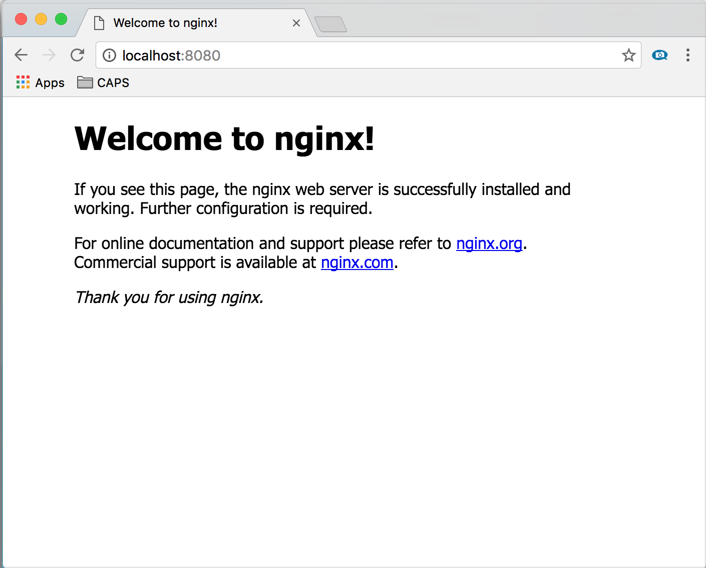

# <a name="push-your-first-image-to-a-private-docker-container-registry-using-the-docker-cli"></a>Docker CLI を使用してプライベート Docker コンテナー レジストリに最初のイメージをプッシュする
[Docker Hub](https://hub.docker.com/) で公開 Docker イメージを格納するように、Azure コンテナー レジストリではプライベート [Docker](http://hub.docker.com) コンテナー イメージを格納および管理します。 コンテナー レジストリに対する[ログイン](https://docs.docker.com/engine/reference/commandline/login/)、[プッシュ](https://docs.docker.com/engine/reference/commandline/push/)、[プル](https://docs.docker.com/engine/reference/commandline/pull/)などの操作には、[Docker コマンド ライン インターフェイス](https://docs.docker.com/engine/reference/commandline/cli/) (Docker CLI) を使用します。

背景と概念の詳細については、[概要](container-registry-intro.md)に関するページを参照してください。


## <a name="prerequisites"></a>前提条件
* **Azure コンテナー レジストリ** - コンテナー レジストリは、Azure サブスクリプションに作成します。 たとえば、[Azure Portal](container-registry-get-started-portal.md) または [Azure CLI 2.0](container-registry-get-started-azure-cli.md) を使用します。
* **Docker CLI** - ローカル コンピューターを Docker ホストとして設定し、Docker CLI コマンドにアクセスするには、[Docker エンジン](https://docs.docker.com/engine/installation/)をインストールします。

## <a name="log-in-to-a-registry"></a>レジストリへのログイン
[レジストリの資格情報](container-registry-authentication.md)を使用してコンテナー レジストリにログインするには、`docker login` を実行します。

次の例では、Azure Active Directory [サービス プリンシパル](../active-directory/active-directory-application-objects.md)の ID とパスワードを渡します。 たとえば、自動化シナリオのために、レジストリにサービス プリンシパルを割り当てることができます。

```
docker login myregistry.azurecr.io -u xxxxxxxx-xxxx-xxxx-xxxx-xxxxxxxxxxxx -p myPassword
```

> [!TIP]
> 必ずレジストリの完全修飾名 (すべて小文字) を指定してください。 この例では `myregistry.azurecr.io` です。

## <a name="steps-to-pull-and-push-an-image"></a>イメージをプルおよびプッシュするための手順
次の例では、Nginx イメージを公開 Docker Hub レジストリからダウンロードし、プライベート Azure コンテナー レジストリにタグ付けして、レジストリにプッシュし、もう一度プルします。

**1.Docker の公式 Nginx イメージをプルする**

まず、ローカル コンピューターに公開 Nginx イメージをプルします。

```
docker pull nginx
```
**2.Nginx コンテナーを起動する**

次のコマンドでは、ポート 8080 でローカルの Nginx コンテナーを対話形式で起動し、Nginx からの出力を確認できるようにしています。 実行中のコンテナーは、停止すると削除されます。

```
docker run -it --rm -p 8080:80 nginx
```

ブラウザーで [http://localhost:8080](http://localhost:8080) に移動して、実行中のコンテナーを表示します。 次のような画面が表示されます。



実行中のコンテナーを停止するには、Ctrl + C キーを押します。

**3.レジストリ内のイメージのエイリアスを作成する**

次のコマンドでは、レジストリへの完全修飾パスを使用して、イメージのエイリアスを作成します。 この例では、レジストリのルートが煩雑にならないように、`samples` 名前空間を指定しています。

```
docker tag nginx myregistry.azurecr.io/samples/nginx
```  

**4.レジストリにイメージをプッシュする**

```
docker push myregistry.azurecr.io/samples/nginx
```

**5.レジストリからイメージをプルする**

```
docker pull myregistry.azurecr.io/samples/nginx
```

**6.レジストリから Nginx コンテナーを起動する**

```
docker run -it --rm -p 8080:80 myregistry.azurecr.io/samples/nginx
```

ブラウザーで [http://localhost:8080](http://localhost:8080) に移動して、実行中のコンテナーを表示します。

実行中のコンテナーを停止するには、Ctrl + C キーを押します。

**7.(省略可) イメージを削除する**

```
docker rmi myregistry.azurecr.io/samples/nginx
```

##<a name="concurrent-limits"></a>同時実行の制限
一部のシナリオでは、複数の呼び出しを同時に実行すると、エラーが発生する場合があります。 以下の表は、Azure コンテナー レジストリに対する "プッシュ" 操作と "プル" 操作について、呼び出しの同時実行数の上限を示したものです。

| 操作  | 制限                                  |
| ---------- | -------------------------------------- |
| プル       | プルの同時実行数はレジストリあたり 10 件まで |
| プッシュ       | プッシュの同時実行数はレジストリあたり 5 件まで |

## <a name="next-steps"></a>次のステップ
基本を理解したので、レジストリの使用を開始する準備ができました。 たとえば、[Azure Container Service](https://azure.microsoft.com/documentation/services/container-service/) クラスターへのコンテナー イメージのデプロイを開始できます。
