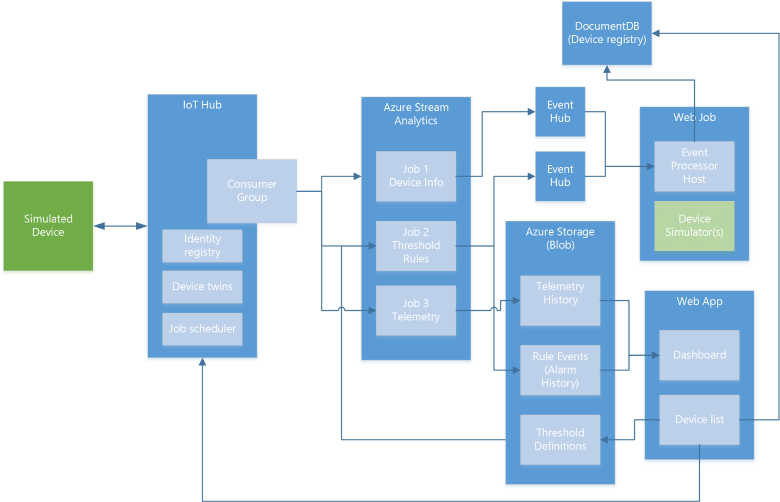

# <a name="remote-monitoring-preconfigured-solution-walkthrough"></a>リモート監視の事前構成済みソリューションのチュートリアル

IoT Suite リモート監視の[事前構成済みソリューション][lnk-preconfigured-solutions]は、遠隔地で実行されている複数のコンピューターを対象としたエンド ツー エンドの監視ソリューションの実装です。 このソリューションは、主要な Azure サービスを組み合わせることで、ビジネス シナリオの汎用的な実装を実現したものです。 このソリューションを独自の実装の出発点として使用し、独自のビジネス要件を満たすように[カスタマイズ][lnk-customize]することができます。

この記事では、リモート監視ソリューションのしくみについて理解しやすいように、その主な構成要素をいくつか取り上げて説明します。 この知識は以下の作業に役立ちます。

* ソリューションの問題のトラブルシューティングを行う。
* 独自の要件を満たすためにソリューションをカスタマイズする方法を計画する。 
* Azure サービスを利用する独自の IoT ソリューションを設計する。

## <a name="logical-architecture"></a>論理アーキテクチャ

次の図は、事前構成済みソリューションの論理コンポーネントの概要を示したものです。



## <a name="simulated-devices"></a>シミュレートされたデバイス

事前構成済みソリューションにおいて、シミュレートされたデバイスは冷却装置 (建物のエアコンや施設の空気処理ユニットなど) を表します。 事前構成済みのソリューションをデプロイすると、[Azure WebJob][lnk-webjobs] で動作する 4 つのシミュレーション デバイスが自動的にプロビジョニングされます。 シミュレーション デバイスを使用することで、ソリューションの動作を簡単に調査することができます。物理デバイスをデプロイする必要はありません。 実際の物理デバイスをデプロイするには、チュートリアル「[デバイスをリモート監視構成済みソリューションに接続する][lnk-connect-rm]」を参照してください。

### <a name="device-to-cloud-messages"></a>デバイスからクラウドへのメッセージ

シミュレーション デバイスはそれぞれ、次の種類のメッセージを IoT Hub に送信することができます。

| メッセージ | Description |
| --- | --- |
| Startup |デバイスは、起動すると、デバイス自体に関する情報が含まれる **device-info** メッセージをバックエンドに送信します。 このデータには、デバイス ID と、デバイスでサポートされているコマンドとメソッドの一覧が含まれています。 |
| プレゼンス |デバイスは定期的に **presence** メッセージを送信して、センサーの存在を感知できるかどうかを報告します。 |
| テレメトリ |デバイスは定期的に **telemetry** メッセージを送信して、デバイスのシミュレーション センサーから収集した温度と湿度のシミュレーション値を報告します。 |

> [!NOTE]
> ソリューションでは、デバイスによってサポートされているコマンドの一覧が、デバイス ツインではなく、Cosmos DB データベースに格納されています。

### <a name="properties-and-device-twins"></a>プロパティとデバイス ツイン

シミュレートされたデバイスは、以下のデバイス プロパティを IoT ハブの[ツイン][lnk-device-twins]に "*報告されるプロパティ*" として送信します。 デバイスは、スタートアップ時と**デバイス状態の変更**コマンドまたはメソッドへの応答時に、報告されるプロパティを送信します。

| プロパティ | 目的 |
| --- | --- |
| Config.TelemetryInterval | デバイスがテレメトリを送信する頻度 (秒) |
| Config.TemperatureMeanValue | シミュレートされた温度テレメトリの平均値を指定します |
| Device.DeviceID |ソリューションでデバイスが作成されるときに指定されるか割り当てられる ID |
| Device.DeviceState | デバイスによって報告される状態 |
| Device.CreatedTime |ソリューションでデバイスが作成された時刻 |
| Device.StartupTime |デバイスが開始された時刻 |
| Device.LastDesiredPropertyChange |必要なプロパティの最後の変更のバージョン番号 |
| Device.Location.Latitude |緯度で表したデバイスの位置 |
| Device.Location.Longitude |経度で表したデバイスの位置 |
| System.Manufacturer |デバイスの製造元 |
| System.ModelNumber |デバイスのモデル番号 |
| System.SerialNumber |デバイスのシリアル番号 |
| System.FirmwareVersion |デバイスのファームウェアの現在のバージョン |
| System.Platform |デバイスのプラットフォーム アーキテクチャ |
| System.Processor |デバイスを実行しているプロセッサ |
| System.InstalledRAM |デバイスに搭載されている RAM の量 |

シミュレーターは、シミュレートされたデバイスのこれらのプロパティをサンプル値と共に送信します。 シミュレーターがシミュレートされたデバイスを初期化するたびに、デバイスは事前定義されたメタデータを報告されるプロパティとして IoT Hub に報告します。 報告されるプロパティは、デバイスのみが更新できます。 報告されるプロパティを変更するには、ソリューション ポータルで必要なプロパティを設定します。 以下の操作は、デバイスが行います。

1. IoT ハブから必要なプロパティを定期的に取得します。
2. 必要なプロパティの値で構成を更新します。
3. 新しい値を、報告されるプロパティとしてハブに返信します。

ソリューションのダッシュボードで、"*必要なプロパティ*" を使用し、[デバイス ツイン][lnk-device-twins]を使用して、デバイスのプロパティを設定することができます。 デバイスは通常、内部状態を更新し、報告されるプロパティとして変更を報告するために、ハブから必要なプロパティの値を読み取ります。

> [!NOTE]
> シミュレートされたデバイスのコードは、IoT Hub に返信される報告されるプロパティを更新するために、必要なプロパティである **Desired.Config.TemperatureMeanValue** と **Desired.Config.TelemetryInterval** のみを使用します。 他の必要なプロパティの変更要求はすべて、シミュレートされたデバイスでは無視されます。

### <a name="methods"></a>メソッド

シミュレートされたデバイスは、ソリューション ポータルから IoT ハブを通じて呼び出された以下のメソッド ([ダイレクト メソッド][lnk-direct-methods]) を処理することができます。

| 方法 | Description |
| --- | --- |
| InitiateFirmwareUpdate |ファームウェアの更新を実行するようにデバイスに指示します |
| Reboot |再起動するようにデバイスに指示します |
| FactoryReset |出荷時の設定へのリセットを実行するようにデバイスに指示します |

いくつかのメソッドは、報告されるプロパティを使用して、進行状況を報告します。 たとえば、**InitiateFirmwareUpdate** メソッドは、デバイスでの非同期的な更新の実行をシミュレートします。 このメソッドはデバイスですぐに制御を返しますが、非同期タスクは報告されるプロパティを使用して、状態の更新をソリューションのダッシュボードに返信し続けます。

### <a name="commands"></a>コマンド

シミュレートされたデバイスは、ソリューション ポータルから IoT ハブを通じて送信される以下のコマンド (cloud-to-device メッセージ) を処理することができます。

| コマンド | Description |
| --- | --- |
| PingDevice |デバイスに *ping* を送信して、デバイスが起動しているかどうかを確認します。 |
| StartTelemetry |デバイスのテレメトリ送信を開始します。 |
| StopTelemetry |デバイスのテレメトリ送信を停止します。 |
| ChangeSetPointTemp |ランダムなデータが生成される設定ポイントの値を変更します。 |
| DiagnosticTelemetry |デバイス シミュレーターをトリガーし、追加のテレメトリ値 (externalTemp) を送信します。 |
| ChangeDeviceState |デバイスの拡張状態プロパティを変更し、デバイスからデバイス情報メッセージを送信します。 |

> [!NOTE]
> これらのコマンド (cloud-to-device メッセージ) とメソッド (ダイレクト メソッド) の比較については、「[cloud-to-device 通信に関するガイダンス][lnk-c2d-guidance]」を参照してください。

## <a name="iot-hub"></a>IoT Hub

[IoT ハブ][lnk-iothub]は、デバイスから送信されたデータをクラウドに取り込んで、Azure Stream Analytics (ASA) ジョブから利用できる状態にします。 ストリームの ASA ジョブは、それぞれ別個の IoT Hub コンシューマー グループを使用して、デバイスから送られたメッセージのストリームを読み取ります。

ソリューションの IoT ハブは、以下の操作も行います。

- ポータルへの接続を許可されているすべてのデバイスの ID と認証キーを格納する ID レジストリを維持します。 ID レジストリを通じて、デバイスを有効および無効にすることができます。
- ソリューション ポータルに代わって、デバイスにコマンドを送信します。
- ソリューション ポータルに代わって、デバイスのメソッドを呼び出します。
- すべての登録済みデバイスのデバイス ツインを保持します。 デバイス ツインは、デバイスによって報告されたプロパティの値を格納します。 また、デバイスが次回の接続時に取得できるように、ソリューション ポータルで設定された必要なプロパティも格納します。
- 複数のデバイスのプロパティを設定したり、複数のデバイスに対してメソッドを呼び出したりするジョブをスケジュールします。

## <a name="azure-stream-analytics"></a>Azure Stream Analytics

リモート監視ソリューションでは、IoT ハブが受け取ったデバイス メッセージは、[Azure Stream Analytics][lnk-asa] (ASA) によって他のバックエンド コンポーネントにディスパッチされて処理されるか、保存されます。 メッセージの内容に基づく特定の機能が、各 ASA ジョブによって実行されます。

**ジョブ 1: デバイス情報** は、受信メッセージ ストリームからデバイス情報メッセージをフィルター処理し、フィルター処理されたメッセージをイベント ハブ エンドポイントに送信します。 デバイスは、起動時および **SendDeviceInfo** コマンドへの応答時に、デバイス情報メッセージを送信します。 このジョブは、次のクエリ定義を使用して **device-info** メッセージを識別します。

```
SELECT * FROM DeviceDataStream Partition By PartitionId WHERE  ObjectType = 'DeviceInfo'
```

このジョブの出力は、後続の処理のためにイベント ハブに出力されます。

**ジョブ 2: 規則**は、デバイスごとのしきい値に対して、温度と湿度の受信テレメトリ値を評価します。 しきい値の値は、ソリューション ポータルから利用できる規則エディターで設定します。 デバイスと値の各ペアは、**参照データ**として Stream Analytics が読み取る BLOB に、タイムスタンプに基づいて格納されます。 このジョブでは、空以外の値が、デバイスに設定された設定しきい値と比較されます。 ">" 条件を超えた場合、ジョブは **alarm** イベントを出力します。このイベントは、しきい値を超えたことを示し、デバイス、値、タイムスタンプ値を表示します。 このジョブは、アラームのトリガーとなるテレメトリ メッセージを次のクエリ定義によって識別します。

```
WITH AlarmsData AS 
(
SELECT
     Stream.IoTHub.ConnectionDeviceId AS DeviceId,
     'Temperature' as ReadingType,
     Stream.Temperature as Reading,
     Ref.Temperature as Threshold,
     Ref.TemperatureRuleOutput as RuleOutput,
     Stream.EventEnqueuedUtcTime AS [Time]
FROM IoTTelemetryStream Stream
JOIN DeviceRulesBlob Ref ON Stream.IoTHub.ConnectionDeviceId = Ref.DeviceID
WHERE
     Ref.Temperature IS NOT null AND Stream.Temperature > Ref.Temperature

UNION ALL

SELECT
     Stream.IoTHub.ConnectionDeviceId AS DeviceId,
     'Humidity' as ReadingType,
     Stream.Humidity as Reading,
     Ref.Humidity as Threshold,
     Ref.HumidityRuleOutput as RuleOutput,
     Stream.EventEnqueuedUtcTime AS [Time]
FROM IoTTelemetryStream Stream
JOIN DeviceRulesBlob Ref ON Stream.IoTHub.ConnectionDeviceId = Ref.DeviceID
WHERE
     Ref.Humidity IS NOT null AND Stream.Humidity > Ref.Humidity
)

SELECT *
INTO DeviceRulesMonitoring
FROM AlarmsData

SELECT *
INTO DeviceRulesHub
FROM AlarmsData
```

このジョブの出力は、後続の処理のためにイベント ハブに送信され、各アラートの詳細は Blob Storage に保存されます。ソリューション ポータルは、ここからアラート情報を読み取ることができます。

**ジョブ 3: テレメトリ** は、2 とおりの方法で、受信デバイス テレメトリ ストリームに対して動作します。 1 つ目の方法では、デバイスから送信されたすべてのテレメトリ メッセージを長期保管を目的とした永続的な Blob Storage に送信します。 2 つ目の方法では、5 分間のスライディング ウィンドウで湿度の平均値、最小値、最大値を計算し、そのデータを Blob Storage に送信します。 ソリューション ポータルは、Blob Storage からテレメトリ データを読み取ってグラフに反映します。 このジョブは、次のクエリ定義を使用します。

```
WITH 
    [StreamData]
AS (
    SELECT
        *
    FROM [IoTHubStream]
    WHERE
        [ObjectType] IS NULL -- Filter out device info and command responses
) 

SELECT
    IoTHub.ConnectionDeviceId AS DeviceId,
    Temperature,
    Humidity,
    ExternalTemperature,
    EventProcessedUtcTime,
    PartitionId,
    EventEnqueuedUtcTime,
    * 
INTO
    [Telemetry]
FROM
    [StreamData]

SELECT
    IoTHub.ConnectionDeviceId AS DeviceId,
    AVG (Humidity) AS [AverageHumidity],
    MIN(Humidity) AS [MinimumHumidity],
    MAX(Humidity) AS [MaxHumidity],
    5.0 AS TimeframeMinutes 
INTO
    [TelemetrySummary]
FROM [StreamData]
WHERE
    [Humidity] IS NOT NULL
GROUP BY
    IoTHub.ConnectionDeviceId,
    SlidingWindow (mi, 5)
```

## <a name="event-hubs"></a>Event Hubs

ASA ジョブである**デバイス情報**と**規則**は、そのデータを Event Hubs に出力し、WebJob で実行されている**イベント プロセッサ**へと確実に転送します。

## <a name="azure-storage"></a>Azure Storage

このソリューションは、対象となるデバイスから未加工のまま集約されたすべてのテレメトリ データを Azure Blob Storage に永続化します。 ポータルは、Blob Storage からテレメトリ データを読み取ってグラフに反映します。 ソリューション ポータルにアラートを表示する際は、しきい値の設定をテレメトリ値がいつ上回ったのかを記録した Blob Storage からデータが読み取られます。 また、ソリューション ポータルで設定したしきい値を記録するときにも Blob Storage が使用されます。

## <a name="webjobs"></a>Web ジョブ

このソリューションの WebJob は、デバイス シミュレーターに加え、Azure WebJob 内で実行される**イベント プロセッサ**をホストします。このイベント プロセッサによって、コマンドの応答が処理されます。 デバイス コマンドの履歴 (Cosmos DB データベースに格納されています) を更新するために、コマンド応答メッセージが使用されます。

## <a name="cosmos-db"></a>Cosmos DB

このソリューションでは、ソリューションに接続されているデバイスに関する情報を格納するために Cosmos DB データベースを使用します。 この情報には、ソリューション ポータルからデバイスに送信されたコマンドと、ソリューション ポータルから呼び出されたメソッドの履歴が含まれています。

## <a name="solution-portal"></a>ソリューション ポータル

ソリューション ポータルは、構成済みソリューションの一部としてデプロイされる Web アプリです。 ソリューション ポータルの主要ページは、ダッシュボードとデバイス一覧です。

### <a name="dashboard"></a>ダッシュボード

Web アプリのこのページでは、デバイスから送信されたテレメトリ データを、PowerBI JavaScript コントロール ([PowerBI-visuals リポジトリ](https://www.github.com/Microsoft/PowerBI-visuals)を参照) で視覚化します。 このソリューションは、ASA テレメトリ ジョブを使用して Blob Storage にテレメトリ データを書き込みます。

### <a name="device-list"></a>Device list

ソリューション ポータルのこのページでは、以下の操作を行うことができます。

* 新しいデバイスをプロビジョニングする。 このアクションによって一意のデバイス ID が設定され、認証キーが生成されます。 デバイスに関する情報は、IoT Hub の ID レジストリとソリューション固有の Cosmos DB データベースの両方に書き込まれます。
* デバイスのプロパティを管理する。 このアクションでは、既存のプロパティを表示したり、新しいプロパティで更新したりすることができます。
* デバイスにコマンドを送信する
* デバイスのコマンド履歴を表示する
* デバイスの有効と無効を切り替える。

## <a name="next-steps"></a>次のステップ

以下の TechNet ブログ投稿には、リモート監視の構成済みソリューションについての詳細情報が記載されています。

* [IoT Suite - Under The Hood - Remote Monitoring (IoT スイート - 内部のしくみ - リモート監視)](http://social.technet.microsoft.com/wiki/contents/articles/32941.iot-suite-under-the-hood-remote-monitoring.aspx)
* [IoT Suite - Remote Monitoring - Adding Live and Simulated Devices (IoT スイート - リモート監視 - ライブおよびシミュレートされたデバイスの追加)](http://social.technet.microsoft.com/wiki/contents/articles/32975.iot-suite-remote-monitoring-adding-live-and-simulated-devices.aspx)

引き続き IoT Suite の概要について学習するには、次の記事を参照してください。

* [デバイスをリモート監視の事前構成済みソリューションに接続する][lnk-connect-rm]
* [azureiotsuite.com サイトでのアクセス許可][lnk-permissions]

[lnk-preconfigured-solutions]: iot-suite-what-are-preconfigured-solutions.md
[lnk-customize]: iot-suite-guidance-on-customizing-preconfigured-solutions.md
[lnk-iothub]: https://azure.microsoft.com/documentation/services/iot-hub/
[lnk-asa]: https://azure.microsoft.com/documentation/services/stream-analytics/
[lnk-webjobs]: https://azure.microsoft.com/documentation/articles/websites-webjobs-resources/
[lnk-connect-rm]: iot-suite-connecting-devices.md
[lnk-permissions]: iot-suite-permissions.md
[lnk-c2d-guidance]: ../iot-hub/iot-hub-devguide-c2d-guidance.md
[lnk-device-twins]:  ../iot-hub/iot-hub-devguide-device-twins.md
[lnk-direct-methods]: ../iot-hub/iot-hub-devguide-direct-methods.md
