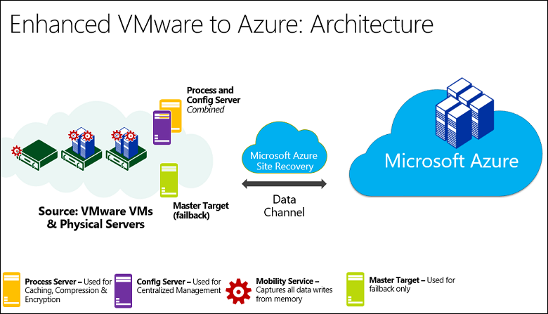
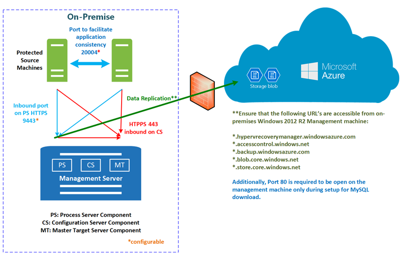

# VMware から Azure へのレプリケーション アーキテクチャ

この記事では、[Azure Site Recovery](site-recovery-overview.md) サービスを使用してオンプレミスの VMware サイトと Azure 間で VMware 仮想マシン (VM) をレプリケート、フェールオーバー、および復旧する場合に使用されるアーキテクチャとプロセスについて説明します。

## アーキテクチャ コンポーネント

次の表と図は、Azure への VMware レプリケーションに使用するコンポーネントの概要を示したものです。  

**コンポーネント** | **要件** | **詳細**
--- | --- | ---
**Azure** | Azure サブスクリプション、Azure ストレージ アカウント、および Azure ネットワーク。 | オンプレミスの VM からレプリケートされたデータはストレージ アカウントに格納されます。 オンプレミスから Azure へのフェールオーバーを実行すると、そのレプリケートされたデータで Azure VM が作成されます。 Azure VM は、作成時に Azure 仮想ネットワークに接続します。
**構成サーバー** | 1 台のオンプレミス VMware VM が、オンプレミスの Site Recovery のコンポーネントを実行するためにデプロイされています。 この VM は、構成サーバー、プロセス サーバー、マスター ターゲット サーバーを実行します。 | 構成サーバーは、オンプレミスと Azure の間の通信を調整し、データのレプリケーションを管理します。
 **プロセス サーバー**:  | 構成サーバーと共に既定でインストールされます。 | レプリケーション ゲートウェイとして機能します。 レプリケーション データを受信し、そのデータをキャッシュ、圧縮、暗号化によって最適化して、Azure Storage に送信します。   また、プロセス サーバーは、レプリケートする VM へのモビリティ サービスのインストールや、オンプレミス VMware サーバーでの VM の自動検出も行います。   デプロイの拡大に合わせて、増大するレプリケーション トラフィックの処理を実行する独立したプロセス サーバーを追加できます。
 **マスター ターゲット サーバー** | 構成サーバーと共に既定でインストールされます。 | Azure からのフェールバック中にレプリケーション データを処理します。   大規模なデプロイでは、フェールバック用に別のマスター ターゲット サーバーを追加できます。
**VMware サーバー** | VMware VM は、オンプレミス vSphere ESXi サーバーでホストされています。 ホストの管理には vCenter サーバーをお勧めします。 | Site Recovery のデプロイ中には、VMware サーバーを Recovery Services コンテナーに追加します。
**レプリケートされたマシン** | レプリケートする各 VMware VM にモビリティ サービスがインストールされます。 | プロセス サーバーから自動的にインストールできるようにすることをお勧めします。 また、サービスを手動でインストールしたり、System Center Configuration Manager などの自動デプロイ方法を使用できます。 

**VMware から Azure へのアーキテクチャ**

## レプリケーション プロセス

1. オンプレミスのコンポーネントと Azure コンポーネントを含むデプロイをセットアップします。 Recovery Services コンテナーで、レプリケーションのソースとターゲットの指定、構成サーバーのセットアップ、レプリケーション ポリシーの作成、レプリケーションの有効化を行います。
2. レプリケーション ポリシーに従ってマシンがレプリケートされると、VM データの初回コピーが Azure Storage にレプリケートされます。
3. 初回のレプリケーションの終了後、Azure への差分変更のレプリケーションが開始されます。 マシンの追跡された変更は .hrl ファイルに保持されます。
    - マシンは、レプリケーション管理のために、受信ポート HTTPS 443 で構成サーバーと通信します。
    - マシンは、受信ポート HTTPS 9443 でレプリケーション データをプロセス サーバーに送信します (変更可能)。
    - 構成サーバーは、送信ポート HTTPS 443 経由で Azure によるレプリケーション管理を調整します。
    - プロセス サーバーは、ソース マシンからデータを受信し、そのデータを最適化して暗号化し、送信ポート 443 を介して Azure Storage に送信します。
    - マルチ VM 整合性を有効にすると、レプリケーション グループ内のマシンは、ポート 20004 を介して相互に通信します。 フェールオーバー時にクラッシュ整合性復旧ポイントとアプリ整合性復旧ポイントを共有するレプリケーション グループに複数のマシンをグループ化する場合にマルチ VM が使用されます。 これは、これらのマシンが同じワークロードを実行していて、一貫性を持たせる必要がある場合に役立ちます。
4. トラフィックは、インターネット経由で Azure Storage のパブリック エンドポイントにレプリケートされます。 また、Azure ExpressRoute の[パブリック ピアリング](../expressroute/expressroute-circuit-peerings.md#azure-public-peering)を使用することもできます。 オンプレミス サイトから Azure へのサイト間 VPN を介したトラフィックのレプリケートはサポートされていません。

**VMware から Azure へのレプリケーション プロセス**

## フェールオーバーとフェールバックのプロセス

レプリケーションがセットアップされ、ディザスター リカバリーの訓練 (フェールオーバーのテスト) を実行してすべてが期待どおりに動作を確認したら、必要に応じて、フェールオーバーとフェールバックを実行できます。

1. 単一のマシンをフェールオーバーするか、複数の VM をフェールオーバーするための復旧計画を作成することができます。
2. フェールオーバーを実行すると、Azure Storage のレプリケートされたデータから Azure VM が作成されます。
3. 最初のフェールオーバーをトリガーするには、Azure VM から、ワークロードへのアクセスを開始するようコミットします。

プライマリ オンプレミス サイトが再度使用可能になると、フェールバックできます。
1. 次のものを含むフェールバック インフラストラクチャを設定する必要があります。
    - **Azure 内の一時的なプロセス サーバー**: Azure からフェールバックするために、プロセス サーバーとして機能する Azure VM をセットアップする必要があります。 この VM は、フェールバックの完了後に削除できます。
    - **VPN 接続**: フェールバックするには、Azure ネットワークからオンプレミス サイトへの VPN 接続 (または Azure ExpressRoute) が必要です。
    - **独立したマスター ターゲット サーバー**: オンプレミスの VMware VM のマスター ターゲット サーバー (構成サーバーに既定でインストールされます) によって、フェールバックが処理されます。 ただし、大量のトラフィックをフェールバックする必要がある場合は、その目的を果たすための独立したオンプレミスのマスター ターゲット サーバーをセットアップする必要があります。
    - **フェールバック ポリシー**: オンプレミスにもう一度レプリケートするには、フェールバック ポリシーが必要です。 これは、オンプレミスから Azure にレプリケーション ポリシーを作成したときに自動的に作成されます。
2. コンポーネントが配置されたら、フェールバックが 3 段階で発生します。
    - 第 1 段階: Azure VM が Azure からオンプレミスの VMware VM へのレプリケートを開始するように、Azure VM を再保護します。
    - 第 2 段階: オンプレミス サイトでフェールオーバーを実行します。
    - 第 3 段階: ワークロードがフェールバックしたら、オンプレミス VM のレプリケートを再び有効にします。

**Azure からの VMware フェールバック**

## 次のステップ

サポート マトリックスを確認します。VMware から Azure へのレプリケーションを有効にするチュートリアルに従ってください。
フェールオーバーとフェールバックを実行します。