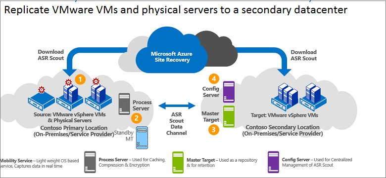

# Site Recovery でのセカンダリ サイトへのオンプレミスのマシンのレプリケーションのしくみ

この記事では、[Azure Site Recovery](site-recovery-overview.md) サービスを使用したオンプレミスの仮想マシンと物理サーバーの Azure へのレプリケートに関係するコンポーネントとプロセスについて説明します。

以下のものをセカンダリ オンプレミス サイトにレプリケートすることができます。
- System Center Virtual Machine Manager (VMM) クラウドで管理されている Hyper-V クラスター上のオンプレミスの Hyper-V VM とスタンドアロン ホスト。
- オンプレミスの VMware VM と Windows/Linux 物理サーバー。 このシナリオでは、レプリケーションは Scout によって管理されます。

コメントはこの記事の末尾、または [Azure Recovery Services フォーラム](https://social.msdn.microsoft.com/forums/azure/home?forum=hypervrecovmgr)で投稿してください。

## Hyper-V VM をセカンダリ オンプレミス サイトにレプリケートする

### アーキテクチャ コンポーネント

Hyper-V VM をセカンダリ サイトにレプリケートするために必要なものを次に示します。

**コンポーネント** | **場所** | **詳細**
--- | --- | ---
**Azure** | Microsoft のアカウントが必要です。 |
**VMM サーバー** | プライマリ サイトに 1 つの VMM サーバーを配置し、セカンダリ サイトにもう 1 つの VMM サーバーを配置することをお勧めします | 各 VMM サーバーは、インターネットに接続している必要があります。   各サーバーには、Hyper-V 機能プロファイルが設定されている VMM プライベート クラウドが少なくとも 1 つ必要です。   VMM サーバーに Azure Site Recovery プロバイダーをインストールします。 Provider は、インターネット経由で Site Recovery サービスを使用してレプリケーションを調整および統制します。 プロバイダーと Azure の間の通信は、セキュリティで保護され、暗号化されます。
**Hyper-V サーバー** |  プライマリおよびセカンダリ VMM クラウドの 1 つ以上の Hyper-V ホスト サーバー。   サーバーはインターネットに接続している必要があります。   プライマリ Hyper-V ホスト サーバーとセカンダリ Hyper-V ホスト サーバーとの間で Kerberos または証明書認証を使用して LAN または VPN 経由で、データがレプリケートされます。  
**Hyper-V VM** | ソース Hyper-V ホスト サーバー上にあります。 | ソース ホスト サーバーには、レプリケートする VM が少なくとも 1 つ必要です。

### レプリケーション プロセス

1. Azure アカウントを設定します。
2. Site Recovery 用のレプリケーション サービス コンテナーを作成し、次のようにコンテナーの設定を構成します。

    - レプリケーション ソースとターゲット (プライマリ サイトとセカンダリ サイト)。
    - Azure Site Recovery プロバイダーと Microsoft Azure Recovery Services エージェントのインストール。 プロバイダーは VMM サーバーにインストールされ、エージェントは各 Hyper-V ホストにインストールされます。
    - ソース VMM クラウドのレプリケーション ポリシーを作成します。 このポリシーは、クラウド内のホストに存在するすべての VM に適用されます。
    - Hyper-V VM のレプリケーションを有効にします。 初期レプリケーションは、レプリケーション ポリシーの設定に従って実行されます。
4. データ変更は追跡され、初期レプリケーションの終了後に差分変更のレプリケーションが開始されます。 アイテムの追跡された変更は .hrl ファイルに保持されます。
5. テスト フェールオーバーを実行して、すべて問題なく動作していることを確認します。

**図1: VMM から VMM へのレプリケーション**

### フェールオーバーとフェールバックのプロセス

1. 計画または計画外[フェールオーバー](site-recovery-failover.md)をオンプレミス サイト間で実行できます。 予定されたフェールオーバーを実行する場合、データが決して失われないように、ソース側の VM はシャット ダウンされます。
2. 単一のマシンをフェールオーバーするか、複数のマシンのフェールオーバーを調整するための[復旧計画](site-recovery-create-recovery-plans.md)を作成することができます。
4. セカンダリ サイトへの計画外フェールオーバーを実行すると、フェールオーバー後に、セカンダリの場所のマシンの保護またはレプリケーションが有効になりません。 計画フェールオーバーを実行した場合は、フェールオーバー後に、セカンダリの場所のマシンが保護されます。
5. その後、フェールオーバーをコミットして、レプリカ VM からワークロードへのアクセスを開始します。
6. プライマリ サイトが再度使用可能になったら、レプリケーションの反転を開始して、セカンダリ サイトからプライマリ サイトにレプリケートします。 レプリケーションの反転により、仮想マシンは保護された状態になりますが、セカンダリ データセンターは引き続きアクティブな場所です。
7. プライマリ サイトをもう一度アクティブな場所にするには、セカンダリからプライマリへの計画フェールオーバーを開始し、続いて別のレプリケーションの反転を実行します。

## セカンダリ サイトに VMware VM/物理サーバーをレプリケートする

InMage Scout で次のアーキテクチャ コンポーネントを使用して、VMware VM または物理サーバーをセカンダリ サイトにレプリケートします。

### アーキテクチャ コンポーネント

**コンポーネント** | **場所** | **詳細**
--- | --- | ---
**Azure** | InMage Scout。 | InMage Scout を入手するには、Azure サブスクリプションが必要です。   Recovery Services コンテナーを作成した後、InMage Scout をダウンロードし、最新の更新プログラムをインストールして、デプロイを設定します。
**プロセス サーバー** | プライマリ サイトにあります。 | キャッシュ、圧縮、データ最適化を処理するプロセス サーバーをデプロイします。   プロセス サーバーでは、保護するマシンへの統合エージェントのプッシュ インストールも処理します。
**構成サーバー** | セカンダリ サイトにあります。 | 構成サーバーは、管理 Web サイトまたは vContinuum コンソールを使用して、デプロイを管理、構成、監視します。
**vContinuum サーバー** | 省略可能。 構成サーバーと同じ場所にインストールされます。 | 保護対象の環境を管理および監視するためのコンソールを提供します。
**マスター ターゲット サーバー** | セカンダリ サイトにあります。 | マスター ターゲット サーバーは、レプリケートされたデータを保持します。 プロセス サーバーからデータを受信して、セカンダリ サイトにレプリカ マシンを作成し、データのリテンション期間ポイントを保持します。   必要のあるマスター ターゲット サーバーの数は、保護するマシンの数によって異なります。   プライマリ サイトにフェールバックする場合は、そこにもマスター ターゲット サーバーが必要です。 統合エージェントはこのサーバーにインストールされます。
**VMware ESX/ESXi と vCenter サーバー** |  VM は、ESX/ESXi ホストでホストされます。 ホストは vCenter サーバーで管理されます。 | VMware VM をレプリケートするには、VMware インフラストラクチャが必要です。
**VM/物理サーバー** |  VMware VM にインストールされた統合エージェントと、レプリケートする物理サーバー。 | エージェントはすべてのコンポーネント間の通信プロバイダーとして機能します。

### レプリケーション プロセス

1. 各サイトでコンポーネント サーバー (構成、プロセス、マスター ターゲット) をセットアップし、レプリケートするマシンに統合エージェントをインストールします。
2. 初期レプリケーションの後、各マシン上のエージェントによって、差分レプリケーションの変更がプロセス サーバーに送信されます。
3. プロセス サーバーは、このデータを最適化して、セカンダリ サイト上のマスター ターゲット サーバーに転送します。 構成サーバーでは、レプリケーション プロセスを管理します。

**図 2: VMware から VMware へのレプリケーション**

## 次のステップ

[サポート マトリックス](site-recovery-support-matrix-to-sec-site.md)を見直す
