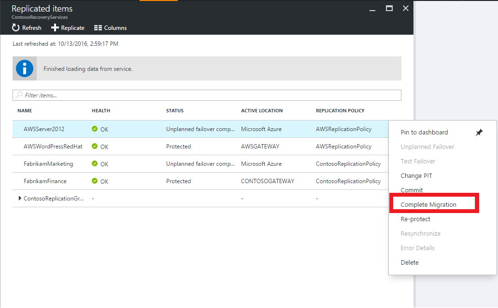

# <a name="replicate-azure-vms-to-another-region-after-migration-to-azure-by-using-azure-site-recovery"></a>Azure Site Recovery を使用して Azure に移行した後、Azure VM を他のリージョンにレプリケートする

>[!NOTE]
> Azure 仮想マシン (VM) の Azure Site Recovery レプリケーションは現在プレビューの段階です。

## <a name="overview"></a>概要

この記事は、Azure Site Recovery を使用して Azure 仮想マシンをオンプレミス環境から Azure に移行した後、2 つの Azure リージョン間でレプリケーションを行うために、その仮想マシンを準備する際に役立ちます。

## <a name="disaster-recovery-and-compliance"></a>ディザスター リカバリーとコンプライアンス
ワークロードを Azure に移行する企業はますます増えています。 ミッション クリティカルなオンプレミスの運用ワークロードを Azure に移行する企業では、コンプライアンスを遵守し、Azure リージョン内で中断が発生するのを避けるために、こうしたワークロードに対して必ずディザスター リカバリーをセットアップしなければなりません。

## <a name="steps-for-preparing-migrated-machines-for-replication"></a>移行済みマシンをレプリケートできるように準備する手順
移行済みマシンを他の Azure リージョンにレプリケートできるようにセットアップする準備を行うには:

1. 移行を完了します。
2. 必要に応じて、Azure エージェントをインストールします。
3. モビリティ サービスを削除します。  
4. VM を再起動します。

以降のセクションでは、ここに挙げた手順について詳しく説明します。

### <a name="step-1-migrate-workloads-running-on-hyper-v-vms-vmware-vms-and-physical-servers-to-run-on-azure-vms"></a>手順 1: Hyper-V VM、VMware VM、および物理サーバーで実行されているワークロードを移行して、Azure VM で実行する

レプリケーションを設定して、オンプレミス Hyper-V、VMware、および物理ワークロードを Azure に移行するには、[Azure Site Recovery による Azure リージョン間での Azure IaaS 仮想マシンの移行](site-recovery-migrate-to-azure.md)に関する記事の手順に従ってください。 

移行後、フェールオーバーをコミットまたは削除する必要はありません。 代わりに、移行する各マシンの **[移行の完了]** オプションを選択します。
1. **[レプリケートされたアイテム]** で VM を右クリックし、**[移行の完了]** をクリックします。 **[OK]** をクリックして手順を完了します。 進行状況は、VM のプロパティから **[Site Recovery ジョブ]** の [移行の完了] ジョブを監視することで追跡できます。
2. **[移行の完了]** アクションにより、移行プロセスが完了し、マシンのレプリケーションが削除され、マシンの Site Recovery の課金が停止されます。

   

### <a name="step-2-install-the-azure-vm-agent-on-the-virtual-machine"></a>手順 2: Azure VM エージェントを仮想マシンにインストールする
Site Recovery 拡張機能を動作させて、VM を保護するには、Azure [VM エージェント](../virtual-machines/windows/classic/agents-and-extensions.md#azure-vm-agents-for-windows-and-linux)を仮想マシンにインストールする必要があります。

>[!IMPORTANT]
>バージョン 9.7.0.0 以降、Windows 仮想マシンでは、モビリティ サービスのインストーラーによって、公開されている最新の Azure VM エージェントもインストールされます。 移行時、仮想マシンは、Site Recovery 拡張機能を含め、VM 拡張機能を使用するためのエージェント インストール前提条件を満たしています。 Azure VM エージェントは、移行済みマシンにインストールされているモビリティ サービスがバージョン 9.6 以前である場合にのみ、手動でインストールする必要があります。

次の表に、VM エージェントのインストールと、そのエージェントのインストールの検証に関する追加情報を示します。

| **操作** | **Windows** | **Linux** |
| --- | --- | --- |
| VM エージェントのインストール |[エージェント MSI](http://go.microsoft.com/fwlink/?LinkID=394789&clcid=0x409)をダウンロードしてインストールします。 インストールを実行するには、管理者特権が必要です。 |最新の [Linux エージェント](../virtual-machines/linux/agent-user-guide.md)をインストールします。 インストールを実行するには、管理者特権が必要です。 ディストリビューション リポジトリからエージェントをインストールすることをお勧めします。 GitHub から直接 Linux VM エージェントをインストールすることは "*お勧めしません*"。  |
| VM エージェントのインストールの検証 |1.Azure VM で C:\WindowsAzure\Packages フォルダーに移動します。 WaAppAgent.exe ファイルがあるはずです。 <br>2.このファイルを右クリックして **[プロパティ]** をクリックし、**[詳細]** タブを選択します。**製品バージョン**が 2.6.1198.718 以上であることを確認します。 |該当なし |


### <a name="step-3-remove-the-mobility-service-from-the-migrated-virtual-machine"></a>手順 3: 移行済み仮想マシンからモビリティ サービスを削除する

Windows/Linux でオンプレミス VMware マシンまたは物理サーバーを移行した場合、モビリティ サービスは、移行済み仮想マシンから手動で削除/アンインストールする必要があります。

>[!IMPORTANT]
>この手順は、Azure に移行された Hyper-V VM には必要ありません。

#### <a name="uninstall-the-mobility-service-on-a-windows-server-vm"></a>Windows Server VMのモビリティ サービスをアンインストールする
Windows Server コンピューターでモビリティ サービスをアンインストールするには、次のいずれかの方法を使用します。

##### <a name="uninstall-by-using-the-windows-ui"></a>Windows UI を使用してアンインストールする
1. コントロール パネルで、**[プログラム]** をクリックします。
2. **Microsoft Azure Site Recovery Mobility Service/マスター ターゲット サーバー**を選択して **[アンインストール]** を選択します。

##### <a name="uninstall-at-a-command-prompt"></a>コマンド プロンプトでアンインストールする
1. 管理者としてコマンド プロンプト ウィンドウを開きます。
2. モビリティ サービスをアンインストールするには、次のコマンドを実行します。

   ```
   MsiExec.exe /qn /x {275197FC-14FD-4560-A5EB-38217F80CBD1} /L+*V "C:\ProgramData\ASRSetupLogs\UnifiedAgentMSIUninstall.log"
   ```

#### <a name="uninstall-the-mobility-service-on-a-linux-computer"></a>Linux コンピューターのモビリティ サービスをアンインストールする
1. Linux サーバーで、**root** ユーザーとしてサインインします。
2. ターミナルで /user/local/ASR に移動します。
3. モビリティ サービスをアンインストールするには、次のコマンドを実行します。

   ```
   uninstall.sh -Y
   ```

### <a name="step-4-restart-the-vm"></a>手順 4: VM を再起動する

モビリティ サービスをアンインストールしたら、他の Azure リージョンへのレプリケーションをセットアップする前に VM を再起動します。


## <a name="next-steps"></a>次のステップ
- [Azure 仮想マシンをレプリケート](site-recovery-azure-to-azure.md)してワークロードの保護を開始する。
- [Azure 仮想マシンのレプリケートに関するネットワーク ガイダンス](site-recovery-azure-to-azure-networking-guidance.md)の詳細を確認する。
