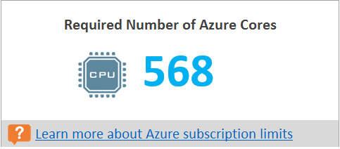
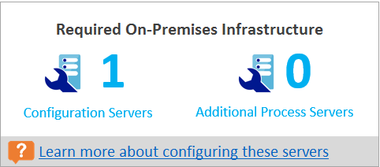
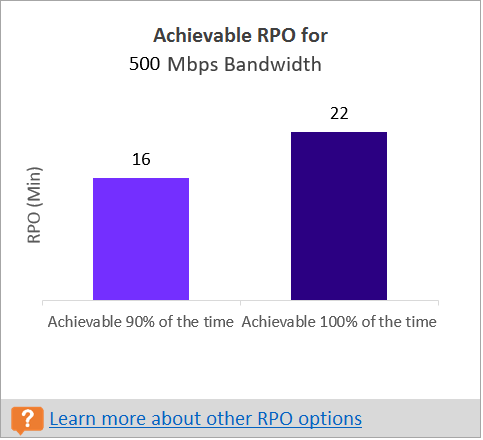
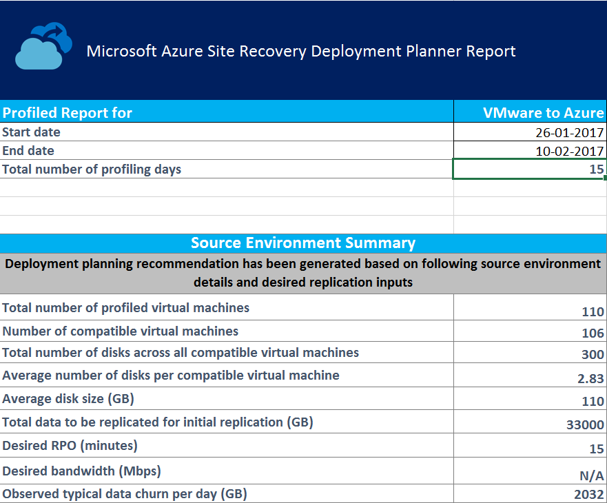

# <a name="azure-site-recovery-deployment-planner"></a>Azure Site Recovery Deployment Planner
この記事は、VMware から Azure へのレプリケーションを行う運用環境のデプロイに関する Azure Site Recovery Deployment Planner のユーザー ガイドです。

## <a name="overview"></a>概要

Site Recovery を使用して VMware 仮想マシン (VM) を保護する前に、必要な RPO (回復ポイントの目標) を達成するうえで十分な帯域幅を日次データ変化率に基づいて割り当てます。 適切な台数の構成サーバーとプロセス サーバーをオンプレミスにデプロイしてください。

また、レプリケーション先となる Azure ストレージ アカウントの種類と数を見極めて作成する必要があります。 レプリケーション元となる運用サーバーの使用量が時間経過に伴って増えることを考慮し、その増加率を見越して、Standard ストレージ アカウントまたは Premium ストレージ アカウントを作成することになります。 ストレージの種類は、読み取り/書き込みの IOPS (I/O Operations Per Second) やデータの変更頻度といったワークロード特性と Site Recovery の制限に基づいて VM ごとに選択します。

Site Recovery Deployment Planner パブリック プレビューはコマンド ライン ツールです。現時点では、VMware から Azure へのレプリケーション シナリオにのみ対応します。 このツールを使用すると、(運用環境には一切影響を与えることなく) リモートから VMware VM をプロファイリングして、レプリケーションとテスト フェールオーバーに必要な帯域幅要件と Azure Storage 要件を把握することができます。 このツールは、Site Recovery のコンポーネントを一切オンプレミスにインストールせずに実行することができます。 ただし、達成スループットの実績値を正確に把握するために、本番デプロイの最初のステップの 1 つとして、最終的にデプロイすることになる Site Recovery 構成サーバーの最低限の要件を満たした Windows Server で Planner を実行することをお勧めします。

このツールで把握できる情報は次のとおりです。

**適合性の評価**

* ディスク数、ディスク サイズ、IOPS、変更頻度、ブートの種類 (EFI/BIOS) に基づく VM の適格性評価
* 差分レプリケーションに必要な推定ネットワーク帯域幅

**ネットワーク帯域幅ニーズと RPO の評価**

* 差分レプリケーションに必要な推定ネットワーク帯域幅
* オンプレミスから Azure までの間で Site Recovery が得られるスループット
* 束ねる VM の数 (初回レプリケーションを所定の時間内に完了するための推定帯域幅に基づく)

**Azure インフラストラクチャの要件**

* VM ごとに必要なストレージの種類 (Standard ストレージ アカウントまたは Premium ストレージ アカウント)
* レプリケーション用にセットアップする Standard ストレージ アカウントと Premium ストレージ アカウントの総数
* ストレージ アカウントの命名に関する推奨事項 (Azure Storage ガイダンスに基づく)
* 全 VM のストレージ アカウントの配置
* サブスクリプションのテスト フェールオーバー (またはフェールオーバー) の前にセットアップする Azure コアの数
* Azure VM の推奨サイズ (オンプレミスの VM ごと)

**オンプレミス インフラストラクチャの要件**
* オンプレミスにデプロイする必要のある構成サーバーとプロセス サーバーの台数

>[!IMPORTANT]
>
>使用率は時間経過に伴って増加する可能性が高いので、このツールにおける上記の計算はいずれも、ワークロード特性の増加率を 30% と仮定して実行されます。また、プロファイリングのメトリック (読み取り/書き込みの IOPS、変更頻度など) はすべて 95 パーセンタイル値が採用されます。 この 2 つの要素 (増加率とパーセンタイル計算) は、設定により変更することができます。 詳細については、「増加率に関する考慮事項」セクションを参照してください。 パーセンタイル値の詳細については、「計算に使用されるパーセンタイル値」セクションを参照してください。
>

## <a name="requirements"></a>必要条件
このツールの処理は、プロファイリングとレポート生成という大きく 2 つの段階に分けられます。 加えて第 3 の選択肢として、スループットの計算のみを行うこともできます。 以下の表に示したのは、プロファイリングとスループット測定に使用するサーバーの要件です。

| サーバーの要件 | Description|
|---|---|
|プロファイリングとスループット測定| <ul><li>オペレーティング システム: Microsoft Windows Server 2012 R2<br>(少なくとも[構成サーバーのサイズの推奨事項](https://aka.ms/asr-v2a-on-prem-components)を満たしていることが望ましい)</li><li>マシン構成: 8 vCPU、16 GB RAM、300 GB HDD</li><li>[Microsoft .NET Framework 4.5](https://aka.ms/dotnet-framework-45)</li><li>[VMware vSphere PowerCLI 6.0 R3](https://aka.ms/download_powercli)</li><li>[Visual Studio 2012 の Microsoft Visual C++ 再頒布可能パッケージ](https://aka.ms/vcplusplus-redistributable)</li><li>このサーバーから Azure へのインターネット アクセス</li><li>Azure ストレージ アカウント</li><li>サーバー上の管理者アクセス権</li><li>100 GB 以上の空きディスク領域 (平均 3 台のディスクがある仮想マシン 1,000 台をそれぞれ 30 日間プロファイリングすることを想定)</li><li>VMware vCenter の統計レベルは 2 以上に設定する必要があります</li><li>443 ポートを許可: ASR Deployment Planner は、このポートを使用して vCenter サーバー/ESXi ホストに接続します</ul></ul>|
| レポートの生成 | Microsoft Excel 2013 以降がインストールされた Windows PC または Windows Server |
| ユーザーのアクセス許可 | 読み取り専用アクセス許可 (プロファイリング中、VMware vCenter サーバー/VMware vSphere ESXi ホストにアクセスするユーザー アカウントに適用) |

> [!NOTE]
>
>このツールでプロファイリングできるのは、VMDK ディスクと RDM ディスクを使用した VM のみです。 iSCSI ディスクまたは NFS ディスクを使用した VM をプロファイリングすることはできません。 Site Recovery は VMware サーバーの iSCSI ディスクと NFS ディスクをサポートしていますが、Deployment Planner はゲスト内に存在せず、プロファイリングは vCenter のパフォーマンス カウンターのみを使用して行われるため、これらの種類のディスクをこのツールで十分把握することはできません。
>

## <a name="download-and-extract-the-public-preview"></a>パブリック プレビューのダウンロードと抽出
1. 最新バージョンの [Site Recovery Deployment Planner パブリック プレビュー](https://aka.ms/asr-deployment-planner)をダウンロードします。  
ツールは .zip フォルダーにパッケージされています。 VMware から Azure へのレプリケーション シナリオに対応しているのは、このツールの最新バージョンのみです。

2. ツールの実行場所となる Windows Server に .zip フォルダーをコピーします。  
このツールは、プロファイリングの対象となる VM のホスト (vCenter サーバー/vSphere ESXi ホスト) にネットワークで接続されている Windows Server 2012 R2 から実行することができます。 ただしこのツールは、[構成サーバーのサイズ ガイドライン](https://aka.ms/asr-v2a-on-prem-components)に準拠したハードウェア構成のサーバーで実行することをお勧めします。 Site Recovery のコンポーネントをオンプレミスにデプロイ済みである場合は、その構成サーバーからツールを実行してください。

 ツールの実行起点となるサーバーには、(プロセス サーバーを一体化した) 構成サーバーと同じハードウェア構成を使用することをお勧めします。 そのような構成によって、Site Recovery がレプリケーションを実行している間の実際のスループットを正確に反映したレポートを得ることができます。 スループットの計算は、サーバーで利用できるネットワーク帯域幅とそのサーバーのハードウェア構成 (CPU、記憶域など) に左右されます。 その他のサーバーからツールを実行した場合、計算されるのは、そのサーバーから Microsoft Azure へのスループットです。 しかもそのサーバーには、構成サーバーとは異なるハードウェア構成が使用されていることが考えられます。そうなると、達成スループットとしてツールから報告される値の精度が低下してしまいます。

3. zip フォルダーを展開します。  
このフォルダーには、複数のファイルとサブフォルダーが格納されています。 実行可能ファイルは、親フォルダーにある ASRDeploymentPlanner.exe です。

    例:  
    .zip ファイルを E:\ ドライブにコピーして展開します。
   E:\ASR Deployment Planner-Preview_v1.2.zip

    E:\ASR Deployment Planner-Preview_v1.2\ ASR Deployment Planner-Preview_v1.2\ ASRDeploymentPlanner.exe

## <a name="capabilities"></a>機能
このコマンド ライン ツール (ASRDeploymentPlanner.exe) は、次の 3 とおりのモードで実行できます。

1. プロファイリング  
2. レポートの生成
3. スループットの取得

最初はプロファイリング モードでツールを実行し、VM のデータ変更頻度と IOPS を取得します。 そのうえでツールを実行してレポートを生成し、ネットワーク帯域幅やストレージの要件を把握してください。

## <a name="profiling"></a>プロファイリング
プロファイリング モードでは、Deployment Planner ツールが vCenter サーバー/vSphere ESXi ホストに接続して VM に関するパフォーマンス データを収集します。

* プロファイリングが運用環境の VM のパフォーマンスに影響を及ぼすことはありません (運用環境の VM に対して直接接続が確立されることはありません)。 すべてのパフォーマンス データは vCenter サーバー/vSphere ESXi ホストから収集されます。
* サーバーに対するプロファイリングの影響を無視できる程度にまで抑えるため、vCenter サーバー/vSphere ESXi ホストがツールによって照会される頻度は 15 分に 1 回となります。 パフォーマンス カウンター データは絶えず保存されるため、そのことでプロファイリングの精度が損なわれることはありません。

### <a name="create-a-list-of-vms-to-profile"></a>プロファイリングする VM のリストを作成する
まず、プロファイリングの対象となる VM のリストを用意する必要があります。 以降の手順に示した VMware vSphere PowerCLI コマンドを使用すれば、vCenter サーバー/vSphere ESXi ホストにあるすべての VM の名前を取得できます。 または、プロファイリングの対象となる VM のフレンドリ名または IP アドレスを手動でファイルに列挙してもかまいません。

1. VMware vSphere PowerCLI がインストールされている VM にサインインします。
2. VMware vSphere PowerCLI コンソールを開きます。
3. スクリプトの実行ポリシーが有効になっていることを確認します。 無効になっている場合は、VMware vSphere PowerCLI コンソールを管理者モードで起動し、次のコマンドを実行して有効にします。

            Set-ExecutionPolicy –ExecutionPolicy AllSigned

4. Connect-VIServer がコマンドレットの名前として認識されない場合は、別途次のコマンドを実行する必要があります。
 
            Add-PSSnapin VMware.VimAutomation.Core 

5. vCenter サーバー/vSphere ESXi ホスト上にあるすべての VM の名前を取得して、リストを .txt ファイルに格納するには、次の 2 つのコマンドを実行します。
&lsaquo;server name&rsaquo;、&lsaquo;user name&rsaquo;、&lsaquo;password&rsaquo;、&lsaquo;outputfile.txt&rsaquo; は、実際の値に置き換えてください。

            Connect-VIServer -Server <server name> -User <user name> -Password <password>

            Get-VM |  Select Name | Sort-Object -Property Name >  <outputfile.txt>

6. 出力ファイルをメモ帳で開き、プロファイリングするすべての VM の名前を別のファイル (ProfileVMList.txt など) にコピーします。VM の名前は 1 行につき 1 つです。 このファイルをコマンド ライン ツールの *-VMListFile* パラメーターの入力として使用します。

    

### <a name="start-profiling"></a>プロファイリングの開始
プロファイリングの対象となる VM のリストを作成したら、プロファイリング モードでツールを実行できます。 プロファイリング モードでツールを実行するための必須のパラメーターと省略可能なパラメーターの一覧を次に示します。

ASRDeploymentPlanner.exe -Operation StartProfiling /?

| パラメーター名 | Description |
|---|---|
| -Operation | StartProfiling |
| -Server | プロファイリングの対象となる VM がある vCenter サーバー/vSphere ESXi ホストの完全修飾ドメイン名または IP アドレス。|
| -User | vCenter サーバー/vSphere ESXi ホストに接続するためのユーザー名。 ユーザーには、少なくとも読み取り専用アクセス権が必要です。|
| -VMListFile | プロファイリングの対象となる VM のリストを含むファイル。 ファイルは、絶対パスまたは相対パスで指定できます。 このファイルには、1 行につき 1 つの VM 名または IP アドレスが記述されている必要があります。 このファイルに指定する仮想マシン名は、vCenter サーバー/vSphere ESXi ホスト上の VM 名と一致している必要があります。<br>たとえば VMList.txt ファイルに、次のように VM を記述することができます。<ul><li>virtual_machine_A</li><li>10.150.29.110</li><li>virtual_machine_B</li><ul> |
| -NoOfDaysToProfile | プロファイリングを実行する日数。 プロファイリングの実行期間は 15 日間より長くすることをお勧めします。それだけの期間があれば、実際の環境のワークロード パターンを十分に観察し、正確な情報を把握することができます。 |
| -Directory | (省略可) プロファイリング中に生成されたプロファイリング データの格納先となる UNC (汎用名前付け規則) パスまたはローカル ディレクトリ パス。 ディレクトリ名を指定しなかった場合、現在のパスの "ProfiledData" という名前のディレクトリが既定のディレクトリとして使用されます。 |
| -Password | (省略可) vCenter サーバー/vSphere ESXi ホストに接続するためのパスワード。 ここで指定しなかった場合は、コマンドの実行時に入力を求められます。|
| -StorageAccountName | (省略可) オンプレミスから Azure へのデータのレプリケーションに関して達成可能なスループットの調査対象となるストレージ アカウントの名前。 このストレージ アカウントにテスト データがアップロードされてスループットが計算されます。|
| -StorageAccountKey | (省略可) ストレージ アカウントにアクセスするためのストレージ アカウント キー。 Azure Portal の [ストレージ アカウント]、[<*ストレージ アカウント名*>]、[設定]、[アクセス キー]、[Key1] \(クラシック ストレージ アカウントの場合は [プライマリ アクセス キー]) の順に移動します。 |
| -Environment | (省略可) レプリケーション先となる Azure ストレージ アカウント環境。 AzureCloud、AzureUSGovernment、AzureChinaCloud の 3 つのうち、いずれかの値を指定できます。 既定値は AzureCloud です。 このパラメーターは、レプリケーション先の Azure リージョンが Azure 米国政府機関または Azure China クラウドであるときに使用します。 |


VM のプロファイリングは、少なくとも 15 ～ 30 日間は実行することをお勧めします。 プロファイリング期間中は ASRDeploymentPlanner.exe が実行状態となります。 ツールには、プロファイリングの時間を日数で入力します。 パブリック プレビュー版ツールの簡単なテストを行うためにプロファイリング期間を数時間または数分とする場合は、日数に換算する必要があります。 たとえばプロファイリング期間が 30 分である場合、入力する値は 30/(60*24) = 0.021 日となります。 プロファイリング期間として許容される最短時間は 30 分です。

構成サーバーまたはプロセス サーバーから Azure へのレプリケーション時に Site Recovery で得られるスループットの調査対象として、プロファイリング中、必要に応じてストレージ アカウントの名前とキーを指定することができます。 プロファイリング時にストレージ アカウントの名前とキーが渡されないと、達成可能なスループットは計算されません。

複数の VM グループを対象として、Deployment Planner ツールのインスタンスを複数実行することができます。 その場合、プロファイリングの対象となるグループ内やグループ間で、同じ VM 名が重複しないようにしてください。 たとえば 10 台の VM (VM1 ～ VM10) をプロファイリングし、数日後に別の 5 台の VM (VM11 ～ VM15) をプロファイリングする必要が生じたとします。この場合、2 つ目の VM グループ (VM11 ～ VM15) について、別のコマンド ライン コンソールからツールを実行することができます。 1 つ目のプロファイリング インスタンスの対象となっていた VM 名を 2 つ目の VM グループに含めることは避けてください。または 2 回目の実行時には、1 回目とは異なる出力ディレクトリを使用してください。 Deployment Planner ツールの 2 つのインスタンスで、同じ出力ディレクトリに対して同じ VM をプロファイリングした場合、生成されるレポートは正確ではなくなります。

VM の構成は、プロファイリング処理の開始時に 1 回だけ捕捉されて、VMDetailList.xml というファイルに保存されます。 この情報は、レポートの生成時に使用されます。 プロファイリングの開始から終了までの間に生じた VM 構成の変化 (コア数、ディスク数、NIC 数が増えるなど) は捕捉されません。 パブリック プレビューを使用したプロファイリングの途中で、その対象となる VM の構成が変わった場合は、以下の回避策によって、レポートの生成時に最新の VM 情報を取得することができます。

* "VMdetailList.xml" をバックアップし、現在の場所からこのファイルを削除します。
* レポートの生成時に -User 引数と -Password 引数を指定します。

プロファイリング コマンドによって、いくつかのファイルがプロファイリング ディレクトリに生成されます。 これらのファイルは一切削除しないでください。削除すると、レポートの生成に影響が生じます。

#### <a name="example-1-profile-vms-for-30-days-and-find-the-throughput-from-on-premises-to-azure"></a>例 1: VM を 30 日間プロファイリングし、オンプレミスから Azure へのレプリケーションのスループットを調査する
```
ASRDeploymentPlanner.exe -Operation StartProfiling -Directory “E:\vCenter1_ProfiledData” -Server vCenter1.contoso.com -VMListFile “E:\vCenter1_ProfiledData\ProfileVMList1.txt”  -NoOfDaysToProfile  30  -User vCenterUser1 -StorageAccountName  asrspfarm1 -StorageAccountKey Eby8vdM02xNOcqFlqUwJPLlmEtlCDXJ1OUzFT50uSRZ6IFsuFq2UVErCz4I6tq/K1SZFPTOtr/KBHBeksoGMGw==
```

#### <a name="example-2-profile-vms-for-15-days"></a>例 2: VM を 15 日間プロファイリングする

```
ASRDeploymentPlanner.exe -Operation StartProfiling -Directory “E:\vCenter1_ProfiledData” -Server vCenter1.contoso.com -VMListFile “E:\vCenter1_ProfiledData\ProfileVMList1.txt”  -NoOfDaysToProfile  15  -User vCenterUser1
```

#### <a name="example-3-profile-vms-for-1-hour-for-a-quick-test-of-the-tool"></a>例 3: ツールの簡単なテストを行うために VM を 1 時間プロファイリングする
```
ASRDeploymentPlanner.exe -Operation StartProfiling -Directory “E:\vCenter1_ProfiledData” -Server vCenter1.contoso.com -VMListFile “E:\vCenter1_ProfiledData\ProfileVMList1.txt”  -NoOfDaysToProfile  0.04  -User vCenterUser1
```

>[!NOTE]
>
>* ツールを実行しているサーバーが再起動されるかクラッシュした場合、または Ctrl + C キーでツールを終了した場合、プロファイリング データは保持されます。 ただし直近 15 分間のプロファイリング データは失われる可能性があります。 そのような場合は、サーバーの再起動後に、プロファイリング モードでもう一度ツールを実行する必要があります。
>* ストレージ アカウントの名前とキーを渡したときは、プロファイリングの最後の段階でスループットが測定されます。 プロファイリングが完了する前にツールを終了した場合、スループットは計算されません。 レポートが生成される前にスループットを調べるために、コマンド ライン コンソールから GetThroughput 操作を実行してください。 そのようにしないと、生成されるレポートにはスループットの情報が出力されません。


## <a name="generate-a-report"></a>レポートの生成
Deployment Planner ツールでは、デプロイの推奨情報をすべてまとめたマクロ有効 Microsoft Excel ファイル (XLSM ファイル) がレポートの出力結果として生成されます。 このレポートは、指定されたディレクトリに DeploymentPlannerReport_<*一意の数値識別子*>.xlsm という名前で格納されます。

プロファイリングが完了したら、レポート生成モードでツールを実行できます。 次の表は、レポート生成モードでツールを実行するための必須のパラメーターと省略可能なパラメーターの一覧です。

`ASRDeploymentPlanner.exe -Operation GenerateReport /?`

|パラメーター名 | Description |
|-|-|
| -Operation | GenerateReport |
| -Server |  レポートを生成するプロファイリング対象の VM がある vCenter/vSphere サーバーの完全修飾ドメイン名または IP アドレス (プロファイリング時と同じ名前または IP アドレスを使用します)。 プロファイリング時に vCenter サーバーを使用した場合は、レポートの生成対象として vSphere サーバーを使用することはできません (その逆も同様)。|
| -VMListFile | レポートを生成するプロファイリング対象 VM のリストが記述されたファイル。 ファイルは、絶対パスまたは相対パスで指定できます。 このファイルには、1 行につき 1 つの VM 名または IP アドレスが記述されている必要があります。 このファイルに指定する VM 名は、vCenter サーバー/vSphere ESXi ホスト上の VM 名と同じであること、またプロファイリング時に使用されたものと一致している必要があります。|
| -Directory | (省略可) プロファイリング データ (プロファイリング中に生成されたファイル) の格納先となる UNC パスまたはローカル ディレクトリ パス。 レポートを生成するには、このデータが必要となります。 名前を指定しなかった場合は、"ProfiledData" ディレクトリが使用されます。 |
| -GoalToCompleteIR | (省略可) プロファイリング対象 VM の初回レプリケーションが完了するまでの目標所要時間。 生成されたレポートには、指定した時間内に初回レプリケーションを完了するために必要な VM の台数が記載されます。 既定値は 72 時間です。 |
| -User | (省略可) vCenter/vSphere サーバーへの接続に使用するユーザー名。 レポートに使用する VM の最新の構成情報 (ディスク数、コア数、NIC 数など) を取得するために使用されます。 名前を指定しなかった場合は、プロファイリングの開始時に収集された構成情報が使用されます。 |
| -Password | (省略可) vCenter サーバー/vSphere ESXi ホストに接続するためのパスワード。 パスワードをパラメーターとして指定しなかった場合は、後でコマンドの実行時に入力を求められます。 |
| -DesiredRPO | (省略可) 必要な RPO (回復ポイントの目標) を分単位で指定します。 既定では 15 分です。|
| -Bandwidth | 帯域幅 (Mbps)。 このパラメーターで指定した帯域幅で達成できる RPO が計算されます。 |
| -StartDate | (省略可) 開始日時を MM-DD-YYYY:HH:MM (24 時間形式) で指定します。 *StartDate* は *EndDate* と一緒に指定する必要があります。 StartDate を指定した場合、StartDate から EndDate までの間に収集されたプロファイリング データを対象にレポートが生成されます。 |
| -EndDate | (省略可) 終了日時を MM-DD-YYYY:HH:MM (24 時間形式) で指定します。 *EndDate* は *StartDate* と一緒に指定する必要があります。 EndDate を指定した場合、StartDate から EndDate までの間に収集されたプロファイリング データを対象にレポートが生成されます。 |
| -GrowthFactor | (省略可) 増加率 (%)。 既定値は 30% です。 |
| -UseManagedDisks | (省略可) UseManagedDisks (Yes/No)。 既定値は Yes です。 1 つのストレージ アカウントに配置できる仮想マシンの数は、仮想マシンのフェールオーバー/テスト フェールオーバーが、非管理対象ディスクではなく、管理ディスクに対して実行されることを想定して計算されます。 |

#### <a name="example-1-generate-a-report-with-default-values-when-the-profiled-data-is-on-the-local-drive"></a>例 1: 既定値でレポートを生成する (プロファイリング データがローカル ドライブにある場合)
```
ASRDeploymentPlanner.exe -Operation GenerateReport -Server vCenter1.contoso.com -Directory “\\PS1-W2K12R2\vCenter1_ProfiledData” -VMListFile “\\PS1-W2K12R2\vCenter1_ProfiledData\ProfileVMList1.txt”
```

#### <a name="example-2-generate-a-report-when-the-profiled-data-is-on-a-remote-server"></a>例 2: レポートを生成する (プロファイリング データがリモート サーバーにある場合)
ユーザーには、リモート ディレクトリに対する読み取り/書き込みアクセス権が必要です。
```
ASRDeploymentPlanner.exe -Operation GenerateReport -Server vCenter1.contoso.com -Directory “\\PS1-W2K12R2\vCenter1_ProfiledData” -VMListFile “\\PS1-W2K12R2\vCenter1_ProfiledData\ProfileVMList1.txt”
```

#### <a name="example-3-generate-a-report-with-a-specific-bandwidth-and-goal-to-complete-ir-within-specified-time"></a>例 3: 特定の帯域幅と初回レプリケーションの目標所要時間を指定してレポートを生成する
```
ASRDeploymentPlanner.exe -Operation GenerateReport -Server vCenter1.contoso.com -Directory “E:\vCenter1_ProfiledData” -VMListFile “E:\vCenter1_ProfiledData\ProfileVMList1.txt” -Bandwidth 100 -GoalToCompleteIR 24
```

#### <a name="example-4-generate-a-report-with-a-5-percent-growth-factor-instead-of-the-default-30-percent"></a>例 4: 増加率を既定値の 30% から 5% に変更してレポートを生成する
```
ASRDeploymentPlanner.exe -Operation GenerateReport -Server vCenter1.contoso.com -Directory “E:\vCenter1_ProfiledData” -VMListFile “E:\vCenter1_ProfiledData\ProfileVMList1.txt” -GrowthFactor 5
```

#### <a name="example-5-generate-a-report-with-a-subset-of-profiled-data"></a>例 5: 一部のプロファイリング データでレポートを生成する
たとえば、30 日間分のプロファイリング データがあるときに 20 日間のみを対象としてレポートを生成します。
```
ASRDeploymentPlanner.exe -Operation GenerateReport -Server vCenter1.contoso.com -Directory “E:\vCenter1_ProfiledData” -VMListFile “E:\vCenter1_ProfiledData\ProfileVMList1.txt” -StartDate  01-10-2017:12:30 -EndDate 01-19-2017:12:30
```

#### <a name="example-6-generate-a-report-for-5-minute-rpo"></a>例 6: RPO を 5 分としてレポートを生成する
```
ASRDeploymentPlanner.exe -Operation GenerateReport -Server vCenter1.contoso.com -Directory “E:\vCenter1_ProfiledData” -VMListFile “E:\vCenter1_ProfiledData\ProfileVMList1.txt”  -DesiredRPO 5
```

## <a name="percentile-value-used-for-the-calculation"></a>計算に使用されるパーセンタイル値
**プロファイリング時に収集されたパフォーマンス メトリックに対し、レポートの生成時に使用される既定のパーセンタイル値について**

すべての VM において、プロファイリング時に収集される読み取り/書き込みの IOPS、書き込み IOPS、データの変更頻度には、既定で 95 パーセンタイル値が使用されます。 そうすることで、レプリケーション先のストレージ アカウントとレプリケーション元の帯域幅の要件を決定する際に、VM の一時的な事象に起因する瞬間的な 100 パーセンタイルを判断から除外することができます。 そのような一時的な事象としては、1 日 1 回実行されるバックアップ ジョブや定期的なデータベース インデックス作成、分析レポート生成アクティビティなど、持続性のない瞬時性イベントが考えられます。

95 パーセンタイル値を使用することで、実際のワークロード特性の真の姿を捉え、それらのワークロードが Azure で実行されている状態でのベストなパフォーマンスを把握することができます。 通常この値を変更する必要はありません。 あえて値を変更する場合 (たとえば 90 パーセンタイルに下げたい場合) は、既定のフォルダーにある構成ファイル *ASRDeploymentPlanner.exe.config* を編集、保存すれば、既にあるプロファイリング データで新しいレポートを生成することができます。
```
<add key="WriteIOPSPercentile" value="95" />      
<add key="ReadWriteIOPSPercentile" value="95" />      
<add key="DataChurnPercentile" value="95" />
```

## <a name="growth-factor-considerations"></a>増加率に関する考慮事項
**デプロイ計画時に増加率を考慮すべき理由**

時間の経過と共に使用率が増える可能性を想定し、ワークロード特性の増大を考慮することはきわめて重要です。 いったん保護された状態を確保した後でワークロードの特性が変化した場合、保護に使用するストレージ アカウントを切り替えるためには、一度保護を無効にしてから再度有効にする必要があります。

たとえば現在、VM のレプリケーションが Standard ストレージ アカウントで問題なく行われているとします。 3 か月後には、おそらくさまざまな変化が生じています。

* たとえば、VM で実行されているアプリケーションのユーザー数が増加します。
* そうなれば VM の変更頻度が増えます。その増大に Site Recovery のレプリケーションを追い付かせるためには、Premium Storage への移行が必要になるでしょう。
* その場合、一度保護を無効にしてから、Premium ストレージ アカウントに切り替えて再度、保護を有効にする必要があります。

そのために、デプロイ計画の段階で増加を考慮することが強く推奨されています。既定値は 30% となっていますが、 アプリケーションの使用パターンや予想される新規ユーザーについて一番よく知っているのは皆さん自身です。この値は、レポートの生成時に適宜変更できます。 また、同じプロファイリング データで、増加率を変えながら複数のレポートを生成することができるほか、最も効果的なレプリケーション先のストレージとレプリケーション元の帯域幅を特定できます。

生成された Microsoft Excel レポートには、次の情報が含まれています。

* [Input (入力)](site-recovery-deployment-planner.md#input)
* [Recommendations (推奨事項)](site-recovery-deployment-planner.md#recommendations-with-desired-rpo-as-input)
* [Recommendations-Bandwidth Input (推奨事項 - 帯域幅入力)](site-recovery-deployment-planner.md#recommendations-with-available-bandwidth-as-input)
* [VM<->Storage Placement (VM<->ストレージの配置)](site-recovery-deployment-planner.md#vm-storage-placement)
* [Compatible VMs (適合 VM)](site-recovery-deployment-planner.md#compatible-vms)
* [Incompatible VMs (不適合 VM)](site-recovery-deployment-planner.md#incompatible-vms)


## <a name="get-throughput"></a>スループットの取得

オンプレミスから Azure へのレプリケーション時に Site Recovery が達成できるスループットを見積もるには、GetThroughput モードで Deployment Planner ツールを実行します。 このツールでは、それが実行されているサーバーを起点としてスループットが計算されます。 このサーバーは、構成サーバーのサイズ ガイドラインに準拠していることが理想です。 Site Recovery のインフラストラクチャ コンポーネントをオンプレミスにデプロイ済みである場合は、その構成サーバーでツールを実行してください。

コマンド ライン コンソールを開いて、Site Recovery のデプロイ プランニング ツール フォルダーに移動します。 以下のパラメーターを指定して ASRDeploymentPlanner.exe を実行してください。

`ASRDeploymentPlanner.exe -Operation GetThroughput /?`

|パラメーター名 | Description |
|-|-|
| -Operation | GetThroughput |
| -Directory | (省略可) プロファイリング データ (プロファイリング中に生成されたファイル) の格納先となる UNC パスまたはローカル ディレクトリ パス。 レポートを生成するには、このデータが必要となります。 ディレクトリ名を指定しなかった場合は、"ProfiledData" ディレクトリが使用されます。 |
| -StorageAccountName | オンプレミスから Azure へのデータのレプリケーションに関して、使用帯域幅の調査に使うストレージ アカウントの名前。 このストレージ アカウントにテスト データがアップロードされて使用帯域幅が計算されます。 |
| -StorageAccountKey | ストレージ アカウントにアクセスするためのストレージ アカウント キー。 Azure Portal の [ストレージ アカウント]、[<*ストレージ アカウント名*>]、[設定]、[アクセス キー]、[Key1] \(クラシック ストレージ アカウントの場合は [プライマリ アクセス キー]) の順に移動します。 |
| -VMListFile | 使用帯域幅の計算に関して、プロファイリングの対象となる VM のリストを含んだファイル。 ファイルは、絶対パスまたは相対パスで指定できます。 このファイルには、1 行につき 1 つの VM 名または IP アドレスが記述されている必要があります。 このファイルに指定する VM 名は、vCenter サーバー/vSphere ESXi ホスト上の VM 名と一致させる必要があります。<br>たとえば VMList.txt ファイルに、次のように VM を記述することができます。<ul><li>VM_A</li><li>10.150.29.110</li><li>VM_B</li></ul>|
| -Environment | (省略可) レプリケーション先となる Azure ストレージ アカウント環境。 AzureCloud、AzureUSGovernment、AzureChinaCloud の 3 つのうち、いずれかの値を指定できます。 既定値は AzureCloud です。 このパラメーターは、レプリケーション先の Azure リージョンが Azure 米国政府機関または Azure China クラウドであるときに使用します。 |

Deployment Planner ツールは、指定されたディレクトリに 64 MB の asrvhdfile<#>.vhd ファイル ("#" はファイルの番号) をいくつか作成します。 これらのファイルをストレージ アカウントにアップロードすることによってスループットが調査されます。 これらのファイルはすべて、スループットの測定後にストレージ アカウントとローカル サーバーから削除されます。 スループットの計算中に何らかの理由でツールが終了した場合、ストレージとローカル サーバーからファイルが削除されません。 この場合は、ファイルを手動で削除する必要があります。

スループットは、特定の時点で測定されるものです。そのときと同じ条件下で Site Recovery がレプリケーション時に達成できる最大スループットと考えてください。 たとえば、いずれかのアプリケーションが同じネットワーク上で、それまでよりも多くの帯域幅を使い始めた場合、レプリケーション時の実際のスループットは変化します。 GetThroughput コマンドを構成サーバーから実行する場合、保護されている VM や実行中のレプリケーションのことまでは考慮されません。 保護されている VM のデータ変更頻度が高いときに GetThroughput 操作を実行した場合、スループットの測定結果に差異が生じます。 さまざまな状況で得られるスループット レベルを把握するために、プロファイリング中はいろいろなタイミングでツールを実行することをお勧めします。 レポートには、最後に測定されたスループットが表示されます。

### <a name="example"></a>例
```
ASRDeploymentPlanner.exe -Operation GetThroughput -Directory  E:\vCenter1_ProfiledData -VMListFile E:\vCenter1_ProfiledData\ProfileVMList1.txt  -StorageAccountName  asrspfarm1 -StorageAccountKey by8vdM02xNOcqFlqUwJPLlmEtlCDXJ1OUzFT50uSRZ6IFsuFq2UVErCz4I6tq/K1SZFPTOtr/KBHBeksoGMGw==
```

>[!NOTE]
>
> Deployment Planner ツールは、ストレージと CPU の特性が構成サーバーと同じサーバーで実行してください。
>
> レプリケーションに関しては、RPO を 100% の時間満たすうえで推奨される帯域幅を設定してください。 適切な帯域幅を設定したにもかかわらず、ツールから報告される達成スループットに改善が見られない場合は、次の作業を行ってください。
>
>  1. Site Recovery のスループットを制限するネットワーク QoS (サービス品質) が存在しているかどうかを確認します。
>
>  2. 物理的にサポートされる最も近い Microsoft Azure リージョンに Site Recovery コンテナーが存在し、ネットワーク待ち時間が最小限で済んでいるかどうかを確認します。
>
>  3. ローカル ストレージの特性を確認し、ハードウェアの強化 (例: HDD から SSD など) が可能であるかどうかを調べます。
>
>  4. [レプリケーションに使用されるネットワーク帯域幅を増やす](./site-recovery-plan-capacity-vmware.md#control-network-bandwidth)ために、プロセス サーバーで Site Recovery の設定を変更します。

## <a name="recommendations-with-desired-rpo-as-input"></a>必要な RPO の入力に関する推奨事項

### <a name="profiled-data"></a>プロファイリング データ


**[Profiled data period (プロファイリング データ期間)]**: プロファイリングが実行された期間です。 レポートの生成時に StartDate オプションと EndDate オプションを使用して生成対象期間を指定しない限り、既定では、すべてのプロファイリング データが計算に使用されます。

**[サーバー名]**: レポートの生成対象の VM がある VMware vCenter または ESXi ホストの名前または IP アドレスです。

**[Desired RPO (必要な RPO)]**: 実際の環境で採用する回復ポイントの目標です。 既定では、15 分、30 分、60 分の 3 とおりの RPO 値について、必要なネットワーク帯域幅が計算されます。 選択した値に応じて、シート上で関連する値が更新されます。 レポートの生成中に *DesiredRPOinMin* パラメーターを使用した場合、その値がこの [Desired RPO (必要な RPO)] の結果に表示されます。

### <a name="profiling-overview"></a>プロファイリングの概要


**[Total Profiled Virtual Machines (プロファイリングされた仮想マシンの合計)]**: プロファイリング データがある VM の総数です。 プロファイリングされなかった VM の名前が VMListFile に含まれている場合、それらの VM はレポートの生成時に考慮されず、プロファイリングされた VM の合計からは除外されます。

**[Compatible Virtual Machines (適合仮想マシン)]**: Site Recovery を使用して Azure で保護できる VM の数です。 適合する (必要なネットワーク帯域幅、ストレージ アカウント数、Azure コア数、構成サーバー数、追加プロセス サーバー数が計算される) VM の総数になります。 適合する VM ごとの詳しい情報は、「Compatible VMs (適合 VM)」セクションで確認できます。

**[Incompatible Virtual Machines (不適合仮想マシン)]**: プロファイリングされた VM のうち、Site Recovery を使用した保護に適合しない VM の数です。 不適合の理由については、「Incompatible VMs (不適合 VM)」セクションで取り上げます。 プロファイリングされなかった VM の名前が VMListFile に含まれている場合、それらの VM は、不適合 VM の数から除外されます。 そのような VM は、[Incompatible VMs (不適合 VM)] セクションの最後に [Data not found (データが見つかりません)] として列挙されます。

**[Desired RPO (必要な RPO)]**: 必要な回復ポイントの目標を分単位で指定します。 15 分 (既定値)、30 分、60 分の 3 とおりの RPO 値についてレポートが生成されます。 シートの右上にある [Desired RPO (必要な RPO)] ボックスの一覧での選択に応じて、レポートされる推奨帯域幅が変化します。 *-DesiredRPO* パラメーターに独自の値を指定してレポートを生成した場合、[Desired RPO (必要な RPO)] ボックスの一覧には、その独自の値が既定値として表示されます。

### <a name="required-network-bandwidth-mbps"></a>必要なネットワーク帯域幅 (Mbps)


**[To meet RPO 100 percent of the time (RPO を 100% の時間満たす場合)]**: 必要な RPO を 100% の時間満たす場合に割り当てる必要のある推奨帯域幅 (Mbps) です。 適合するすべての VM について、RPO からの逸脱 (RPO 違反) を防止し、安定した状態の差分レプリケーションを行うためには、この帯域幅を専用に確保する必要があります。

**[To meet RPO 90 percent of the time (RPO を 90% の時間満たす場合)]**: 必要な RPO を 100% の時間満たす帯域幅を、ブロードバンドのコストなど何らかの理由で設定できない場合は、必要な RPO を 90% の時間満たすことのできる水準まで帯域幅を下げて設定することが選択肢として考えられます。 設定する帯域幅を引き下げたことによって生じる影響を明らかにするために、レポートには RPO 違反の件数とその期間についての what-if 分析が示されます。

**[Achieved Throughput (達成スループット)]**: GetThroughput コマンドが実行されたサーバーから、ストレージ アカウントが存在する Microsoft Azure リージョンまでのスループットです。 このスループットは、構成サーバー/プロセス サーバーのストレージとネットワークの特性が、Deployment Planner ツールを実行したサーバーのそれと同じ状態に保たれていることを前提とし、Site Recovery を使用して適合 VM を保護した場合に得られる推定値を表しています。

レプリケーションに関しては、RPO を 100% の時間満たすうえで推奨される帯域幅を設定してください。 必要な帯域幅を設定したにもかかわらず、ツールから報告される達成スループットに改善が見られない場合は、次の作業を行ってください。

1. Site Recovery のスループットを制限するネットワーク QoS (サービス品質) が存在しているかどうかを確認します。

2. 物理的にサポートされる最も近い Microsoft Azure リージョンに Site Recovery コンテナーが存在し、ネットワーク待ち時間が最小限で済んでいるかどうかを確認します。

3. ローカル ストレージの特性を確認し、ハードウェアの強化 (例: HDD から SSD など) が可能であるかどうかを調べます。

4. [レプリケーションに使用されるネットワーク帯域幅を増やす](./site-recovery-plan-capacity-vmware.md#control-network-bandwidth)ために、プロセス サーバーで Site Recovery の設定を変更します。

既に保護された VM がある構成サーバーまたはプロセス サーバーで Deployment Planner ツールを実行する場合は、複数回にわたって実行してください。 特定の時点で実行されている処理に伴う変更の頻度によって、達成スループットの値は変化します。

企業による Site Recovery のデプロイでは、常に [ExpressRoute](https://aka.ms/expressroute) を使用することをお勧めします。

### <a name="required-storage-accounts"></a>必要なストレージ アカウント
次のグラフは、すべての適合 VM を保護するうえで必要なストレージ アカウントの総数です (Standard と Premium)。 使用するストレージ アカウントを VM ごとに把握するには、「VM-Storage placement (VM<->ストレージの配置)」セクションを参照してください。


### <a name="required-number-of-azure-cores"></a>必要な Azure コア数
適合するすべての VM のフェールオーバー (またはテスト フェールオーバー) 前にセットアップされるコアの総数です。 使用できるコア数がサブスクリプションに不足している場合、フェールオーバー (またはテスト フェールオーバー) 時に Site Recovery が VM を作成できません。



### <a name="required-on-premises-infrastructure"></a>必要なオンプレミス インフラストラクチャ
この図は、適合するすべての VM を保護するために必要な構成サーバーと追加のプロセス サーバーの総数を表しています。 サポートされる[構成サーバーの推奨サイズ](https://aka.ms/asr-v2a-on-prem-components)に応じて、追加のサーバーが提案されます。 この提案は、1 日あたりの変更頻度か、または保護対象 VM の最大数 (VM ごとに平均 3 台のディスクを想定) に基づいて行われ、構成サーバーまたは追加のプロセス サーバーで、最初に到達した方の制限が適用されます。 1 日あたりの総変更頻度と保護対象ディスクの総数の詳細については、[入力] セクションに記載されています。



### <a name="what-if-analysis"></a>What-if 分析
What-if 分析は、設定する帯域幅を引き下げて、必要な RPO を 90% の時間だけ満たすようにしたとき、プロファイリング期間中、おおよそ何件の違反が発生するかを可能性として提示するものです。 RPO 違反は日々生じることが考えられ、 グラフにはそれぞれの日のピーク RPO が表示されます。
この分析結果を見て、RPO 違反がすべての日にわたって存在しているかどうか、また、帯域幅を 100% から引き下げた場合の 1 日のピーク RPO が許容範囲内にあるかどうかを判断することができます。 許容範囲内であれば、レプリケーションに割り当てる帯域幅を引き下げることができます。そうでなければ、必要な RPO を 100% の時間満たすことのできる水準まで帯域幅を引き上げます。


### <a name="recommended-vm-batch-size-for-initial-replication"></a>Recommended VM batch size for initial replication (初回レプリケーションの推奨 VM バッチ サイズ)
このセクションには、必要な RPO を 100% の時間満たすことのできる推奨帯域幅を設定した状態で、初回レプリケーションを 72 時間以内に完了するという前提で保護することができる VM の推奨台数が表示されます。 この値は設定によって変更することができます。 レポートの生成時に変更するには、*GoalToCompleteIR* パラメーターを使用します。

ここに示されるグラフには、適合するすべての VM について検出された平均 VM サイズに基づき、初回レプリケーションを 72 時間以内に完了する場合の、帯域幅値の範囲と算出された VM のバッチ サイズ カウントが表示されます。

パブリック プレビューのレポートでは、どの VM をバッチに含めるべきかは明記されません。 [Compatible VMs (適合 VM)] セクションに示されたディスク サイズをもとに、それぞれの VM のサイズを調べ、1 つのバッチに含める VM を選択するか、既知のワークロード特性に基づいて VM を選択してください。 初回レプリケーションの完了時間は、VM の実際のディスク サイズや使用済みディスク領域、ネットワーク スループットに比例して変化します。


### <a name="growth-factor-and-percentile-values-used"></a>増加率と使用パーセンタイル値
このセクションのシートの一番下には、プロファイリング対象 VM に対するすべてのパフォーマンス カウンターのパーセンタイル値 (既定では 95 パーセンタイル) と、すべての計算に使用される増加率 (%) (既定では 30%) が表示されます。


## <a name="recommendations-with-available-bandwidth-as-input"></a>使用可能な帯域幅の入力に関する推奨事項


Site Recovery のレプリケーション用に設定できる帯域幅 (Mbps) の上限があらかじめわかっているケースもあるでしょう。 Deployment Planner ツールでは、使用可能な帯域幅を (レポートの生成中に -Bandwidth パラメーターで) 入力し、達成可能な RPO (分) を取得することができます。 こうして得た達成可能 RPO 値をもとに、帯域幅を追加でセットアップすべきか、または障害復旧ソリューションとしてその RPO で問題がないかを判断することができます。



## <a name="input"></a>入力
[入力] ワークシートには、プロファイリングの対象となった VMware 環境の概要が表示されます。



**[開始日]**/**[終了日]**: レポートの生成時に考慮されたプロファイリング データの開始日と終了日です。 既定では、プロファイリングを開始した日付が開始日に、プロファイリングを終了した日付が終了日になります。 この値は、レポートの生成時に StartDate パラメーターと EndDate パラメーターで指定できます。

**[Total number of profiling days (プロファイリングの合計日数)]**: レポートの生成対象期間 (開始日から終了日まで) におけるプロファイリングの合計日数です。

**[Number of compatible virtual machines (適合する仮想マシンの数)]**: 適合する (必要なネットワーク帯域幅、ストレージ アカウント数、Microsoft Azure コア数、構成サーバー数、追加プロセス サーバー数が計算される) VM の総数です。

**[Total number of disks across all compatible virtual machines (すべての適合仮想マシンにおけるディスクの総数)]**: この数は、デプロイ後の環境で使用する構成サーバー数と追加プロセス サーバー数を決定するための入力値の 1 つとして使用されます。

**[Average number of disks per compatible virtual machine (適合する仮想マシン 1 台あたりの平均ディスク数)]**: 適合するすべての VM から割り出される平均ディスク数です。

**[Average disk size (GB) (平均ディスク サイズ (GB))]**: 適合するすべての VM から割り出される平均ディスク サイズです。

**[Desired RPO (minutes) (必要な RPO (分))]**: 必要な帯域幅の見積もりに使用された回復ポイントの目標です。既定の RPO またはレポートの生成時に "DesiredRPO" パラメーターに指定された値が該当します。

**[Desired bandwidth (Mbps) (必要な帯域幅 (Mbps))]**: レポートの生成時に、達成可能な RPO を見積もる目的で "Bandwidth" パラメーターに指定した値です。

**[Observed typical data churn per day (GB) (観察された 1 日あたりの標準的なデータの変更頻度 (GB))]**: プロファイリングの全日数にわたって観察されたデータ変更頻度の平均値です。 この数は、デプロイ後の環境で使用する構成サーバー数と追加プロセス サーバー数を決定するための入力値の 1 つとして使用されます。


## <a name="vm-storage-placement"></a>VM-Storage placement (VM<->ストレージの配置)


**[Disk Storage Type (ディスク ストレージの種類)]**: **[VMs to Place (配置する VM)]** 列に示されている該当 VM をすべてレプリケートするために使用される "Standard" または "Premium" のストレージ アカウントです。

**[Suggested Prefix (推奨プレフィックス)]**: ストレージ アカウントの名前に使用できる 3 文字のプレフィックスです。 独自のプレフィックスを使用することもできますが、[ストレージ アカウントのパーティションの名前付け規則](https://aka.ms/storage-performance-checklist)に準拠したプレフィックスがツールから提案されます。

**[Suggested Account Name (推奨アカウント名)]**: 推奨されるプレフィックスを付けた場合のストレージ アカウントの名前が表示されます。 山かっこ (< と >) で囲まれた名前は、カスタムの入力値に置き換えてください。

**[Log Storage Account (ログ ストレージ アカウント)]**: レプリケーションのログはすべて Standard ストレージ アカウントに格納されます。 レプリケーション先が Premium ストレージ アカウントである VM については、ログの格納用として別途 Standard ストレージ アカウントをセットアップしてください。 1 つの Standard ログ ストレージ アカウントを複数の Premium レプリケーション ストレージ アカウントで使用できます。 レプリケーション先が Standard ストレージ アカウントである VM では、同じストレージ アカウントがログに使用されます。

**[Suggested Log Account Name (推奨ログ アカウント名)]**: 推奨されるプレフィックスを付けた場合のストレージ ログ アカウントの名前が表示されます。 山かっこ (< と >) で囲まれた名前は、カスタムの入力値に置き換えてください。

**[Placement Summary (配置の概要)]**: レプリケーションとフェールオーバー (テスト フェールオーバーを含む) 時にストレージ アカウントにかかる VM の総負荷の概要が表示されます。 たとえばストレージ アカウントに関連付けられた VM の総数や、そのストレージ アカウントに配置されている全 VM における読み取り/書き込み IOPS の合計、書き込み (レプリケーション) IOPS の合計、全ディスクの合計セットアップ サイズ、ディスクの総数が表示されます。

**[Virtual Machines to Place (配置する仮想マシン)]**: パフォーマンスと稼働率を最大限に引き出すために、指定のストレージ アカウントに配置すべき全 VM が一覧表示されます。

## <a name="compatible-vms"></a>Compatible VMs (適合 VM)


**[VM 名]**: レポートの生成時に VMListFile で使った VM の名前または IP アドレスです。 また、VM にアタッチされたディスク (VMDK) もこの列に一覧表示されます。 vCenter において名前または IP アドレスが重複する VM を区別するために、VM 名には ESXi ホスト名が一緒に表示されます。 このときに表示される ESXi ホストは、プロファイリング期間中、Deployment Planner ツールによって VM が最初に検出されたときに配置されていたホストです。

**[VM Compatibility (VM 適合性)]**: **Yes** と **Yes**\* の 2 つの値があります。 **Yes**\* は、[Azure Premium Storage](https://aka.ms/premium-storage-workload) に適した VM があるインスタンスに付けられます。 ただしこの場合、プロファイリング結果によると変更頻度または IOPS の高いディスクが、P20 または P30 のカテゴリに適しているのに、ディスクのサイズが原因でそれよりも低い P10 または P20 にマッピングされています。 ストレージ アカウントでは、Premium Storage のディスク タイプが、そのサイズに基づいて決定されます。 For example:
* 128 GB 未満の場合は P10
* 128 ～ 512 GB の場合は P20
* 512 ～ 1,024 GB の場合は P30
* 1,025 ～ 2,048 GB の場合は P40
* 2,049 ～ 4,095 GB の場合は P50

したがって、ディスクのワークロード特性上は P20 または P30 に分類されるものの、サイズ上はそれよりも低い Premium Storage ディスク タイプに対応している VM は、Deployment Planner ツールによって **Yes**\* として表示されます。 そのうえで、推奨される適切な Premium Storage ディスク タイプに合わせてレプリケーション元のディスク サイズを変更するか、またはレプリケーション先のディスク タイプをフェールオーバー後に変更するように促されます。

**[ストレージの種類]**: Standard または Premium があります。

**[Suggested Prefix (推奨プレフィックス)]**: ストレージ アカウントの 3 文字のプレフィックスです。

**[ストレージ アカウント]**: ストレージ アカウントの推奨プレフィックスを使用した名前です。

**[R/W IOPS (with Growth Factor) (読み取り/書き込みの IOPS (増加率を考慮))]**: 将来的な増加率 (既定では 30%) を加味した、ディスクに対するピーク ワークロードの読み取り/書き込み IOPS (既定では 95 パーセンタイル) です。 VM のトータルな読み取り/書き込み IOPS は、必ずしもその個々のディスクの読み取り/書き込み IOPS を足した値になるとは限りません。VM の読み取り/書き込みのピーク IOPS が、プロファイリングの全期間を通じての、その各ディスクにおける読み取り/書き込み IOPS の合計のピークであるためです。

**[Data Churn in Mbps (with Growth Factor) (データの変更頻度 (Mbps) (増加率を考慮))]**: 将来的な増加率 (既定では 30%) を加味した、ディスクに対する変更頻度のピーク値 (既定では 95 パーセンタイル) です。 VM のトータルなデータ変更頻度は、必ずしもその個々のディスクのデータ変更頻度を足した値になるとは限りません。VM のデータ変更頻度のピークが、プロファイリングの全期間を通じての、その各ディスクにおける変更頻度の合計のピークであるためです。

**[Azure VM Size (Azure VM サイズ)]**: オンプレミス VM に対応する Azure Cloud Services の仮想マシンとして理想的なサイズです。 この判断は、オンプレミス VM のメモリ、ディスク数/コア数/NIC 数、読み取り/書き込みの IOPS に基づいて行われます。 オンプレミスの VM が備えているこうした特性をすべて満たした最小の Azure VM サイズが確実に提案されます。

**[ディスク数]**: VM の仮想マシン ディスク (VMDK) の総数です。

**[ディスク サイズ (GB)]**: VM の全ディスクの合計セットアップ サイズです。 VM に含まれる個々のディスクのサイズも表示されます。

**[コア]**: VM に搭載されている CPU コアの数です。

**[メモリ (MB)]**: VM に搭載されている RAM です。

**[NIC]**: VM に搭載されている NIC の数です。

**[Boot Type (ブートの種類)]**: VM のブートの種類です。 BIOS と EFI のどちらかになります。 現在 Azure Site Recovery でサポートされるブートの種類は BIOS だけです。 ブートの種類が EFI である仮想マシンはすべて、[Incompatible VMs (不適合 VM)] ワークシートに一覧表示されます。

**[OS の種類]**: VM の OS の種類です。 [Windows] と [Linux or other (Linux またはその他)] のどちらかになります。

## <a name="incompatible-vms"></a>Incompatible VMs (不適合 VM)


**[VM 名]**: レポートの生成時に VMListFile で使った VM の名前または IP アドレスです。 また、VM にアタッチされた VMDK もこの列に一覧表示されます。 vCenter において名前または IP アドレスが重複する VM を区別するために、VM 名には ESXi ホスト名が一緒に表示されます。 このときに表示される ESXi ホストは、プロファイリング期間中、Deployment Planner ツールによって VM が最初に検出されたときに配置されていたホストです。

**[VM Compatibility (VM 適合性)]**: 指定された VM が Site Recovery での使用に不適合である理由が表示されます。 理由は VM の不適合ディスクごとに記述され、公開されている[ストレージの制限](https://aka.ms/azure-storage-scalbility-performance)に基づく次のいずれかの状況に該当します。

* ディスク サイズが 4,095 GB を超えている。 Azure Storage では現在、4,095 GB を超えるデータ ディスク サイズがサポートされません。
* OS ディスクが 2,048 GB を超えている。 Azure Storage では現在、2,048 GB を超える OS ディスク サイズがサポートされません。
* ブートの種類が EFI である。 現在 Azure Site Recovery でサポートされる仮想マシンのブートの種類は BIOS だけです。

* VM サイズの合計 (レプリケーション + テスト フェールオーバー) が、サポートされているストレージ アカウントの上限サイズ (35 TB) を超えている。 これは通常、VM にあるいずれか 1 台のディスクのパフォーマンス特性が、Azure または Site Recovery でサポートされる Standard ストレージの上限を超えている場合に発生します。 そのような VM は Premium Storage の領域に分類されます。 一方、Premium ストレージ アカウントでサポートされる最大サイズは 35 TB です。保護対象となる単一の VM を複数のストレージ アカウントにまたがって保護することはできません。 また、保護対象 VM で実行されるテスト フェールオーバーは、レプリケーション処理と同じストレージ アカウントで実行されることに注意してください。 この場合、レプリケーションの進行と同時にテスト フェールオーバーが正常完了するためには、対象となるディスク サイズの 2 倍の容量をセットアップする必要があります。
* レプリケーション元の IOPS が、ストレージでサポートされている IOPS の上限 (ディスクあたり 5,000 IOPS) を超えている。
* レプリケーション元の IOPS が、ストレージでサポートされている IOPS の上限 (VM あたり 80,000 IOPS) を超えている。
* 平均データ変更頻度が、Site Recovery でサポートされているデータ変更頻度の上限 (ディスクの平均 I/O サイズで 10 MBps) を超えている。
* VM 上の全ディスクにおけるトータルなデータ変更頻度が、Site Recovery でサポートされるデータ変更頻度の上限 (VM あたり 54 MBps) を超えている。
* 平均実効書き込み IOPS が、Site Recovery でサポートされるディスク IOPS の上限 (840) を超えている。
* 算出されたスナップショット ストレージが、スナップショット ストレージに関してサポートされている上限 (10 TB) を超えている。

**[R/W IOPS (with Growth Factor) (読み取り/書き込みの IOPS (増加率を考慮))]**: 将来的な増加率 (既定では 30%) を加味した、ディスクに対するピーク ワークロードの IOPS (既定では 95 パーセンタイル) です。 VM のトータルな読み取り/書き込み IOPS は、必ずしもその個々のディスクの読み取り/書き込み IOPS を足した値になるとは限りません。VM の読み取り/書き込みのピーク IOPS が、プロファイリングの全期間を通じての、その各ディスクにおける読み取り/書き込み IOPS の合計のピークであるためです。

**[Data Churn in Mbps (with Growth Factor) (データの変更頻度 (Mbps) (増加率を考慮))]**: 将来的な増加率 (既定では 30%) を加味した、ディスクに対する変更頻度のピーク値 (既定では 95 パーセンタイル) です。 VM のトータルなデータ変更頻度は、必ずしもその個々のディスクのデータ変更頻度を足した値になるとは限りません。VM のデータ変更頻度のピークが、プロファイリングの全期間を通じての、その各ディスクにおける変更頻度の合計のピークであるためです。

**[ディスク数]**: VM の VMDK の総数です。

**[ディスク サイズ (GB)]**: VM の全ディスクの合計セットアップ サイズです。 VM に含まれる個々のディスクのサイズも表示されます。

**[コア]**: VM に搭載されている CPU コアの数です。

**[メモリ (MB)]**: VM に搭載されている RAM のサイズです。

**[NIC]**: VM に搭載されている NIC の数です。

**[Boot Type (ブートの種類)]**: VM のブートの種類です。 BIOS と EFI のどちらかになります。 現在 Azure Site Recovery でサポートされるブートの種類は BIOS だけです。 ブートの種類が EFI である仮想マシンはすべて、[Incompatible VMs (不適合 VM)] ワークシートに一覧表示されます。

**[OS の種類]**: VM の OS の種類です。 [Windows] と [Linux or other (Linux またはその他)] のどちらかになります。


## <a name="site-recovery-limits"></a>Site Recovery の制限

**レプリケーション先のストレージ** | **レプリケーション元の平均ディスク I/O サイズ** |**レプリケーション元ディスクの平均データ変更頻度** | **レプリケーション元ディスクの 1 日あたりのデータ変更頻度合計**
---|---|---|---
Standard Storage | 8 KB | 2 MBps | (ディスクあたり) 168 GB
Premium P10 ディスク | 8 KB | 2 MBps | (ディスクあたり) 168 GB
Premium P10 ディスク | 16 KB | 4 MBps | (ディスクあたり) 336 GB
Premium P10 ディスク | 32 KB 以上 | 8 MBps | (ディスクあたり) 672 GB
Premium P20 または P30 ディスク | 8 KB  | 5 MBps | (ディスクあたり) 421 GB
Premium P20 または P30 ディスク | 16 KB 以上 |10 MBps | (ディスクあたり) 842 GB

前述の数値は、I/O のオーバーラップを 30% とした場合の平均値です。 Site Recovery は、オーバーラップ比に基づくより高いスループットと、より大きな書き込みサイズ、そして実ワークロード I/O 動作を扱うことができます。 上記の数値には、標準的なバックログとして約 5 分が想定されています。 つまりデータはアップロード後 5 分以内に処理されて復旧ポイントが作成されます。

上記の制限は、弊社のテストに基づいて公開されていますが、アプリケーション I/O として想定されるすべての組み合わせを網羅したものではありません。 実際の結果は、ご使用のアプリケーションで発生するさまざまな I/O によって異なることが考えられます。 理想的な結果を得るために、デプロイ計画後も必ず、テスト フェールオーバーを使用してアプリケーションのテストを徹底し、パフォーマンスの真の姿を把握することをお勧めします。

## <a name="updating-the-deployment-planner"></a>Deployment Planner の更新
Deployment Planner を更新するには、次の手順に従います。

1. 最新バージョンの [Azure Site Recovery Deployment Planner](https://aka.ms/asr-deployment-planner) をダウンロードします。

2. 実行するサーバーに .zip フォルダーをコピーします。

3. zip フォルダーを展開します。

4. 次のいずれかを実行します。
 * 最新バージョンにプロファイリングの修正プログラムが含まれていない場合で、かつ現在ご利用のバージョンの Deployment Planner でプロファイリングが既に進行中である場合は、プロファイリングを続行してください。
 * 最新バージョンにプロファイリングの修正プログラムが含まれている場合は、現在ご利用のバージョンでのプロファイリングを中止し、新しいバージョンでプロファイリングを再開することをお勧めします。

  >[!NOTE]
  >
  >新しいバージョンでプロファイリングを開始するときは、既存のファイルにプロファイル データが追記されるよう、同じ出力ディレクトリ パスを指定してください。 そうすることで、すべてのプロファイリング データを使ってレポートが生成されます。 異なる出力ディレクトリを指定した場合は、新しいファイルが作成され、古いプロファイリング データはレポートの生成に使用されません。
  >
  >Deployment Planner の更新に使われる .zip ファイルには、その都度、累積的な更新が格納されています。 以前のフォルダーに最新のファイルをコピーする必要はありません。 新しいフォルダーを作成して使用できます。


## <a name="version-history"></a>バージョン履歴

### <a name="131"></a>1.3.1
更新日: 2017 年 7 月 19 日

次の新機能を追加しました。

* レポートの生成における 1 TB を超える大容量ディスクのサポートを追加しました。 今後は Deployment Planner を使用して、ディスク サイズが 1 TB を超える仮想マシン (最大 4,095 GB) のレプリケーションを計画することができます。
詳細については、[Azure Site Recovery における大容量ディスクのサポート](https://azure.microsoft.com/en-us/blog/azure-site-recovery-large-disks/)に関するページを参照してください。


### <a name="13"></a>1.3
更新日: 2017 年 5 月 9 日

次の新機能を追加しました。

* レポートの生成における管理ディスクのサポートを追加しました。 1 つのストレージ アカウントに配置できる仮想マシンの数が、フェールオーバー/テスト フェールオーバーに使用する管理ディスクが選択されているかどうかに基づいて計算されます。        


### <a name="12"></a>1.2
更新日: 2017 年 4 月 7 日

次の修正を加えました。

* それぞれの仮想マシンが保護の対象として適合しているかどうかを判断するために、ブートの種類 (BIOS または EFI) のチェックを追加しました。
* [Compatible VMs (適合 VM)] ワークシートと [Incompatible VMs (不適合 VM)] ワークシートで、それぞれの仮想マシンについて OS の種類の情報を追加しました。
* 米国政府と中国の Microsoft Azure リージョンで、GetThroughput 操作に対応しました。
* vCenter と ESXi サーバーに関して前提条件のチェックをいくつか追加しました。
* ロケールの設定が英語以外のときに不正確なレポートが生成されていました。


### <a name="11"></a>1.1
更新日: 2017 年 3 月 9 日

次の問題が修正されました。

* 同じ名前または IP アドレスの複数の VM が異なる ESXi ホストにまたがって vCenter に存在する場合に、VM をプロファイリングすることができない。
* 適合 VM ワークシートと不適合 VM ワークシートのコピーと検索が無効。

### <a name="10"></a>1.0
更新日: 2017 年 2 月 23 日

Azure Site Recovery Deployment Planner パブリック プレビュー 1.0 には、以下に示す既知の問題があります。これらの問題は今後の更新プログラムで解決される予定です。

* このツールの利用は VMware から Azure へのレプリケーション シナリオに限られます。Hyper-V から Azure へのデプロイには利用できません。 Hyper-V から Azure へのシナリオでは、[Hyper-V Capacity Planner ツール](./site-recovery-capacity-planning-for-hyper-v-replication.md)をご利用ください。
* 米国政府と中国の Microsoft Azure リージョンでは、GetThroughput 操作がサポートされていません。
* 同じ名前または IP アドレスの複数の VM が異なる ESXi ホストにまたがって vCenter サーバーに存在する場合に、VM をプロファイリングすることができない。 このバージョンでは、VMListFile 内の重複する VM 名または IP アドレスに対するプロファイリングがスキップされます。 これを回避するには、vCenter サーバーを対象にするのではなく、ESXi ホストを対象にして VM をプロファイリングしてください。 ESXi ホストごとに 1 つのインスタンスを実行する必要があります。
