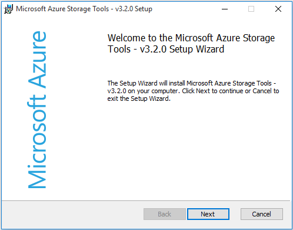
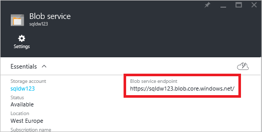
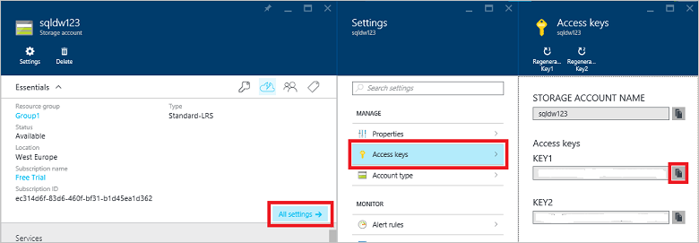
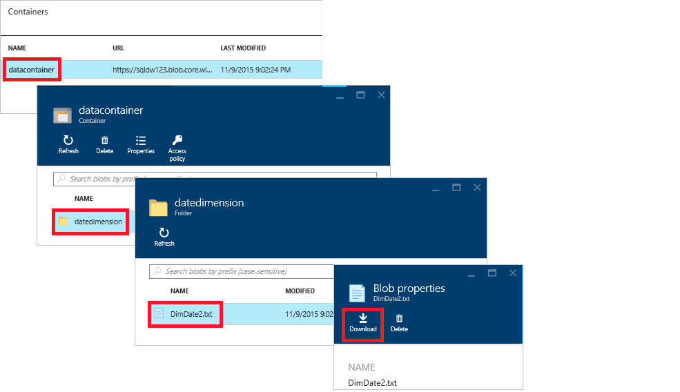

# <a name="load-data-with-polybase-in-sql-data-warehouse"></a>SQL Data Warehouse で PolyBase によってデータを読み込む
> [!div class="op_single_selector"]
> * [Redgate](sql-data-warehouse-load-with-redgate.md)  
> * [Data Factory](sql-data-warehouse-get-started-load-with-azure-data-factory.md)  
> * [PolyBase](sql-data-warehouse-get-started-load-with-polybase.md)  
> * [BCP](sql-data-warehouse-load-with-bcp.md)
> 
> 

このチュートリアルでは、AzCopy と PolyBase を使用して SQL Data Warehouse にデータを読み込む方法を説明します。 このチュートリアルを行うと、以下の作業方法がわかります。

* AzCopy を使用して Azure Blob Storage にデータをコピーする
* データを定義するデータベース オブジェクトを作成する
* データを読み込む T-SQL クエリを実行する

> [!VIDEO https://channel9.msdn.com/Blogs/Azure/Loading-data-with-PolyBase-in-Azure-SQL-Data-Warehouse/player]
> 
> 

## <a name="prerequisites"></a>前提条件
このチュートリアルを進めるには、次のものが必要です。

* SQL Data Warehouse データベース
* 種類が Standard ローカル冗長ストレージ (Standard-LRS)、Standard geo 冗長ストレージ (Standard-GRS)、または Standard 読み取りアクセス geo 冗長ストレージ (Standard-RAGRS) である Azure ストレージ アカウント
* AzCopy コマンド ライン ユーティリティ Microsoft Azure Storage Tools と共にインストールされる[最新バージョンの AzCopy][latest version of AzCopy] をダウンロードしてインストールします。
  
    

## <a name="step-1-add-sample-data-to-azure-blob-storage"></a>手順 1: Azure Blob Storage にサンプル データを追加する
データを読み込むには、Azure Blob Storage にサンプル データを配置する必要があります。 この手順では、Azure Storage BLOB にサンプル データを設定します。 その後、PolyBase を使用して、このサンプル データを SQL Data Warehouse データベースに読み込みます。

### <a name="a-prepare-a-sample-text-file"></a>A. サンプル テキスト ファイルを準備する
サンプル テキスト ファイルを準備するには:

1. メモ帳を開き、データの次の行を新しいファイルにコピーします。 これをローカル一時ディレクトリに %temp%\DimDate2.txt として保存します。

```
20150301,1,3
20150501,2,4
20151001,4,2
20150201,1,3
20151201,4,2
20150801,3,1
20150601,2,4
20151101,4,2
20150401,2,4
20150701,3,1
20150901,3,1
20150101,1,3
```

### <a name="b-find-your-blob-service-endpoint"></a>B. BLOB サービス エンドポイントを検索する
BLOB サービス エンドポイントを検索するには:

1. Azure Portal で、**[参照]** > **[ストレージ アカウント]** の順に選択します。
2. 使用するストレージ アカウントをクリックします。
3. ストレージ アカウントのブレードで、BLOB をクリックします。
   
    
4. 後の操作のために、BLOB サービス エンドポイントの URL を保存しておきます。
   
    

### <a name="c-find-your-azure-storage-key"></a>C. Azure ストレージ キーを検索する
Azure ストレージ キーを検索するには:

1. Azure Portal で、**[参照]** > **[ストレージ アカウント]** の順に選択します。
2. 使用するストレージ アカウントをクリックします。
3. **[すべての設定]** > **[アクセス キー]** の順に選択します。
4. いずれかのアクセス キーをクリップボードにコピーするために、コピー ボックスをクリックします。
   
    

### <a name="d-copy-the-sample-file-to-azure-blob-storage"></a>D. サンプル ファイルを Azure Blob Storage にコピーする
Azure Blob Storage にデータをコピーするには:

1. コマンド プロンプトを開き、ディレクトリを AzCopy インストール ディレクトリに変更します。 このコマンドによって、64 ビットの Windows クライアント上の既定のインストール ディレクトリに移動します。
   
    ```
    cd /d "%ProgramFiles(x86)%\Microsoft SDKs\Azure\AzCopy"
    ```
2. 次のコマンドを実行してファイルをアップロードします。 <blob service endpoint URL> に Blob service エンドポイント URL を指定し、<azure_storage_account_key> に Azure ストレージ アカウント キーを指定します。
   
    ```
    .\AzCopy.exe /Source:C:\Temp\ /Dest:<blob service endpoint URL> /datacontainer/datedimension/ /DestKey:<azure_storage_account_key> /Pattern:DimDate2.txt
    ```

[AzCopy コマンド ライン ユーティリティの概要][Getting Started with the AzCopy Command-Line Utility]に関するページも参照してください。

### <a name="e-explore-your-blob-storage-container"></a>E. Blob Storage コンテナーを調べる
Blob Storage にアップロードしたファイルを表示するには:

1. Blob service ブレードに戻ります。
2. [コンテナー] の下の **[データコンテナー]**をダブルクリックします。
3. データへのパスをたどるために **datedimension** フォルダーをクリックすると、アップロードした **DimDate2.txt** ファイルが表示されます。
4. プロパティを表示するには、 **DimDate2.txt**をクリックします。
5. BLOB プロパティ ブレードでは、ファイルをダウンロードまたは削除することができます。
   
    

## <a name="step-2-create-an-external-table-for-the-sample-data"></a>手順 2: サンプル データ用の外部テーブルを作成する
このセクションでは、サンプル データを定義する外部テーブルを作成します。

PolyBase では、外部テーブルを使用して、Azure Blob Storage 内のデータにアクセスします。 データは SQL Data Warehouse 内に保存されないため、PolyBase は、データベース スコープの資格情報を使用して、外部データへの認証を処理します。

この手順の例では、以下の Transact-SQL ステートメントを使用して、外部テーブルを作成します。

* [Create Master Key (Transact-SQL)][Create Master Key (Transact-SQL)]: データベース スコープの資格情報のシークレットを暗号化します。
* [Create Database Scoped Credential (Transact-SQL)][Create Database Scoped Credential (Transact-SQL)]: Azure ストレージ アカウントの認証情報を指定します。
* [Create External Data Source (Transact-SQL)][Create External Data Source (Transact-SQL)]: Azure Blob Storage の場所を指定します。
* [Create External File Format (Transact-SQL)][Create External File Format (Transact-SQL)]: データの形式を指定します。
* [Create External Table (Transact-SQL)][Create External Table (Transact-SQL)]: テーブル定義とデータの場所を指定します。

SQL Data Warehouse データベースに対して、このクエリを実行します。 Azure Blob Storage 内の DimDate2.txt サンプル データを指す dbo スキーマに、DimDate2External という名前の外部テーブルが作成されます。

```sql
-- A: Create a master key.
-- Only necessary if one does not already exist.
-- Required to encrypt the credential secret in the next step.

CREATE MASTER KEY;


-- B: Create a database scoped credential
-- IDENTITY: Provide any string, it is not used for authentication to Azure storage.
-- SECRET: Provide your Azure storage account key.


CREATE DATABASE SCOPED CREDENTIAL AzureStorageCredential
WITH
    IDENTITY = 'user',
    SECRET = '<azure_storage_account_key>'
;


-- C: Create an external data source
-- TYPE: HADOOP - PolyBase uses Hadoop APIs to access data in Azure blob storage.
-- LOCATION: Provide Azure storage account name and blob container name.
-- CREDENTIAL: Provide the credential created in the previous step.

CREATE EXTERNAL DATA SOURCE AzureStorage
WITH (
    TYPE = HADOOP,
    LOCATION = 'wasbs://<blob_container_name>@<azure_storage_account_name>.blob.core.windows.net',
    CREDENTIAL = AzureStorageCredential
);


-- D: Create an external file format
-- FORMAT_TYPE: Type of file format in Azure storage (supported: DELIMITEDTEXT, RCFILE, ORC, PARQUET).
-- FORMAT_OPTIONS: Specify field terminator, string delimiter, date format etc. for delimited text files.
-- Specify DATA_COMPRESSION method if data is compressed.

CREATE EXTERNAL FILE FORMAT TextFile
WITH (
    FORMAT_TYPE = DelimitedText,
    FORMAT_OPTIONS (FIELD_TERMINATOR = ',')
);


-- E: Create the external table
-- Specify column names and data types. This needs to match the data in the sample file.
-- LOCATION: Specify path to file or directory that contains the data (relative to the blob container).
-- To point to all files under the blob container, use LOCATION='.'

CREATE EXTERNAL TABLE dbo.DimDate2External (
    DateId INT NOT NULL,
    CalendarQuarter TINYINT NOT NULL,
    FiscalQuarter TINYINT NOT NULL
)
WITH (
    LOCATION='/datedimension/',
    DATA_SOURCE=AzureStorage,
    FILE_FORMAT=TextFile
);


-- Run a query on the external table

SELECT count(*) FROM dbo.DimDate2External;

```


Visual Studio の SQL Server オブジェクト エクスプローラーで、外部ファイル形式、外部データ ソース、および DimDate2External テーブルを表示できます。


## <a name="step-3-load-data-into-sql-data-warehouse"></a>手順 3: SQL Data Warehouse にデータを読み込む
外部テーブルが作成されたので、新しいテーブルにデータを読み込むか、既存のテーブルに挿入することができます。

* 新しいテーブルにデータを読み込むには、[CREATE TABLE AS SELECT (Transact-SQL)][CREATE TABLE AS SELECT (Transact-SQL)] ステートメントを実行します。 新しいテーブルには、クエリで指定された列があります。 列のデータ型は、外部テーブル定義内のデータ型と一致します。
* 既存のテーブルにデータを読み込むには、[INSERT...SELECT (Transact-SQL)][INSERT...SELECT (Transact-SQL)] ステートメントを使用します。

```sql
-- Load the data from Azure blob storage to SQL Data Warehouse

CREATE TABLE dbo.DimDate2
WITH
(   
    CLUSTERED COLUMNSTORE INDEX,
    DISTRIBUTION = ROUND_ROBIN
)
AS
SELECT * FROM [dbo].[DimDate2External];
```

## <a name="step-4-create-statistics-on-your-newly-loaded-data"></a>手順 4: 新しく読み込んだデータの統計を作成する
SQL Data Warehouse は、統計の自動作成または自動更新を行いません。 そのため、高いクエリ パフォーマンスを実現するには、最初の読み込み後に各テーブルの各列についての統計を作成することが重要です。 また、データが大幅に変更された後で統計を更新することも重要です。

この例では、新しい DimDate2 テーブルに単一列統計を作成します。

```sql
CREATE STATISTICS [DateId] on [DimDate2] ([DateId]);
CREATE STATISTICS [CalendarQuarter] on [DimDate2] ([CalendarQuarter]);
CREATE STATISTICS [FiscalQuarter] on [DimDate2] ([FiscalQuarter]);
```

詳細については、[統計][Statistics]に関するページを参照してください。  

## <a name="next-steps"></a>次のステップ
PolyBase を使用するソリューションを開発する際に知っておく必要がある情報については、[PolyBase ガイド][PolyBase guide]を参照してください。

<!--Image references-->


<!--Article references-->
[PolyBase in SQL Data Warehouse Tutorial]: ./sql-data-warehouse-get-started-load-with-polybase.md
[Load data with bcp]: ./sql-data-warehouse-load-with-bcp.md
[Statistics]: ./sql-data-warehouse-tables-statistics.md
[PolyBase guide]: ./sql-data-warehouse-load-polybase-guide.md
[Getting Started with the AzCopy Command-Line Utility]:../storage/common/storage-use-azcopy.md
[latest version of AzCopy]:../storage/common/storage-use-azcopy.md

<!--External references-->
[supported source/sink]: https://msdn.microsoft.com/library/dn894007.aspx
[copy activity]: https://msdn.microsoft.com/library/dn835035.aspx
[SQL Server destination adapter]: https://msdn.microsoft.com/library/ms141095.aspx
[SSIS]: https://msdn.microsoft.com/library/ms141026.aspx


[CREATE EXTERNAL DATA SOURCE (Transact-SQL)]:https://msdn.microsoft.com/library/dn935022.aspx
[CREATE EXTERNAL FILE FORMAT (Transact-SQL)]:https://msdn.microsoft.com/library/dn935026.aspx
[CREATE EXTERNAL TABLE (Transact-SQL)]:https://msdn.microsoft.com/library/dn935021.aspx

[DROP EXTERNAL DATA SOURCE (Transact-SQL)]:https://msdn.microsoft.com/library/mt146367.aspx
[DROP EXTERNAL FILE FORMAT (Transact-SQL)]:https://msdn.microsoft.com/library/mt146379.aspx
[DROP EXTERNAL TABLE (Transact-SQL)]:https://msdn.microsoft.com/library/mt130698.aspx

[CREATE TABLE AS SELECT (Transact-SQL)]:https://msdn.microsoft.com/library/mt204041.aspx
[INSERT...SELECT (Transact-SQL)]:https://msdn.microsoft.com/library/ms174335.aspx
[CREATE MASTER KEY (Transact-SQL)]:https://msdn.microsoft.com/library/ms174382.aspx
[CREATE CREDENTIAL (Transact-SQL)]:https://msdn.microsoft.com/library/ms189522.aspx
[CREATE DATABASE SCOPED CREDENTIAL (Transact-SQL)]:https://msdn.microsoft.com/library/mt270260.aspx
[DROP CREDENTIAL (Transact-SQL)]:https://msdn.microsoft.com/library/ms189450.aspx
