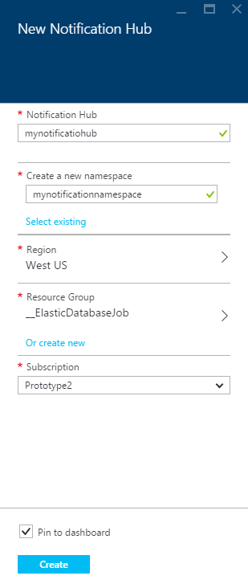

1. [Azure ポータル](https://portal.azure.com)にサインインします。

2. **[新規]** > **[Web + モバイル]** > **[Notification Hub]** の順に選択します。
   
      
      
3. **[Notification Hub]** ボックスに一意の名前を入力します。 **リージョン**、**サブスクリプション**、**リソース グループ**を選択します (既にある場合)。 
   
    ハブを作成する Service Bus 名前空間を既に用意してある場合、以下を行います。

    a. **[名前空間]** 領域で、**[既存項目の選択]** リンクを選択します。 
   
    b. **[作成]**を選択します。

    まだ Service Bus 名前空間を用意していない場合、ハブ名に基づいて作成される既定の名前を使用できます (その名前空間名が使用できる場合)。
   
      

    名前空間と通知ハブを作成したら、Azure Portal が開きます。 
   
      

4. **[設定]** > **[アクセス ポリシー]** の順に選択します。 使用可能な 2 つの接続文字列を書き留めてください。 これらの接続文字列は、後でプッシュ通知を処理するために必要になります。
   
      

